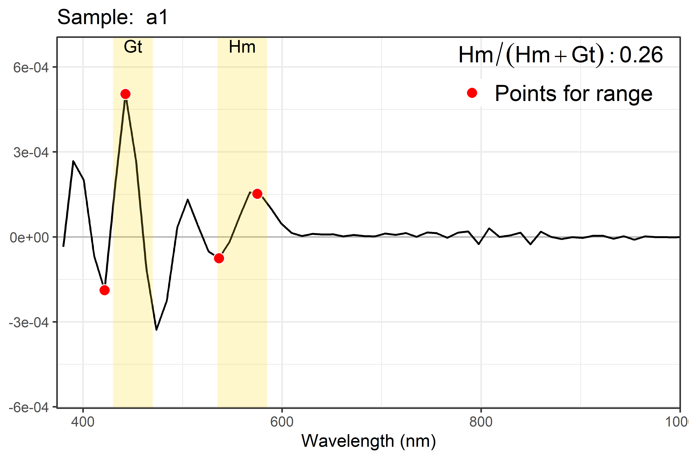
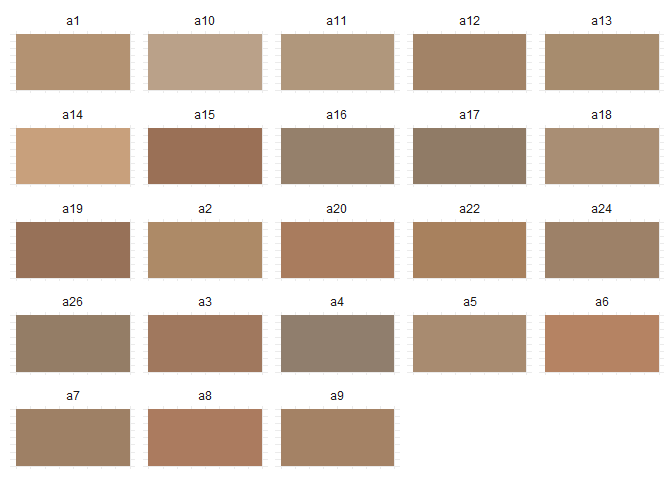

<!-- README.md is generated from README.Rmd. Please edit that file -->

# Overview <a href="https://fgu5tav0.github.io/OxSR/"></a>

<!-- badges: start -->

   
 
<!-- badges: end -->

The OxSR package calculates the ratio between hematite and goethite
oxides in soil via diffuse reflectance.

In soil science, understanding the mineral composition is often a
starting point for research in various areas.

Iron oxides are widely studied and play a role in a range of studies,
from fertilization and nutrient dynamics to contamination and
sustainable practices.

Techniques for determining these minerals are often expensive and
time-consuming. Therefore, practical, rapid, and sensitive methods such
as diffuse reflectance in the visible spectrum have gained importance.
This technique can also be used to determine soil color, another
parameter that helps in understanding the environment.

## Installation

``` r
install.packages("OxSR")
```

``` r
library(OxSR)
```

## Example

## Function: `relation_hm_gt()`

``` r

# database
data("soil_refle")

# one sample
dados_relacao <- relation_hm_gt(data = soil_refle[,c(1,2)], 
               plot = T,
               name_wave = "wave",
               points_smoothing = 0.3, 
               pv_tolerance = c(1,1,1,1),
               hm_gt_limits = list(hm = c(535, 585),
                                   gt = c(430, 470)))
```



``` r

# with several samples
soil_refle |> 
relation_hm_gt() |> 
  dplyr::mutate(dplyr::across(2:7, ~ format(., scientific = TRUE, digits = 3))) |>
  gt::gt()
```

<div id="lkhehnokxr" style="padding-left:0px;padding-right:0px;padding-top:10px;padding-bottom:10px;overflow-x:auto;overflow-y:auto;width:auto;height:auto;">
<style>#lkhehnokxr table {
  font-family: system-ui, 'Segoe UI', Roboto, Helvetica, Arial, sans-serif, 'Apple Color Emoji', 'Segoe UI Emoji', 'Segoe UI Symbol', 'Noto Color Emoji';
  -webkit-font-smoothing: antialiased;
  -moz-osx-font-smoothing: grayscale;
}
&#10;#lkhehnokxr thead, #lkhehnokxr tbody, #lkhehnokxr tfoot, #lkhehnokxr tr, #lkhehnokxr td, #lkhehnokxr th {
  border-style: none;
}
&#10;#lkhehnokxr p {
  margin: 0;
  padding: 0;
}
&#10;#lkhehnokxr .gt_table {
  display: table;
  border-collapse: collapse;
  line-height: normal;
  margin-left: auto;
  margin-right: auto;
  color: #333333;
  font-size: 16px;
  font-weight: normal;
  font-style: normal;
  background-color: #FFFFFF;
  width: auto;
  border-top-style: solid;
  border-top-width: 2px;
  border-top-color: #A8A8A8;
  border-right-style: none;
  border-right-width: 2px;
  border-right-color: #D3D3D3;
  border-bottom-style: solid;
  border-bottom-width: 2px;
  border-bottom-color: #A8A8A8;
  border-left-style: none;
  border-left-width: 2px;
  border-left-color: #D3D3D3;
}
&#10;#lkhehnokxr .gt_caption {
  padding-top: 4px;
  padding-bottom: 4px;
}
&#10;#lkhehnokxr .gt_title {
  color: #333333;
  font-size: 125%;
  font-weight: initial;
  padding-top: 4px;
  padding-bottom: 4px;
  padding-left: 5px;
  padding-right: 5px;
  border-bottom-color: #FFFFFF;
  border-bottom-width: 0;
}
&#10;#lkhehnokxr .gt_subtitle {
  color: #333333;
  font-size: 85%;
  font-weight: initial;
  padding-top: 3px;
  padding-bottom: 5px;
  padding-left: 5px;
  padding-right: 5px;
  border-top-color: #FFFFFF;
  border-top-width: 0;
}
&#10;#lkhehnokxr .gt_heading {
  background-color: #FFFFFF;
  text-align: center;
  border-bottom-color: #FFFFFF;
  border-left-style: none;
  border-left-width: 1px;
  border-left-color: #D3D3D3;
  border-right-style: none;
  border-right-width: 1px;
  border-right-color: #D3D3D3;
}
&#10;#lkhehnokxr .gt_bottom_border {
  border-bottom-style: solid;
  border-bottom-width: 2px;
  border-bottom-color: #D3D3D3;
}
&#10;#lkhehnokxr .gt_col_headings {
  border-top-style: solid;
  border-top-width: 2px;
  border-top-color: #D3D3D3;
  border-bottom-style: solid;
  border-bottom-width: 2px;
  border-bottom-color: #D3D3D3;
  border-left-style: none;
  border-left-width: 1px;
  border-left-color: #D3D3D3;
  border-right-style: none;
  border-right-width: 1px;
  border-right-color: #D3D3D3;
}
&#10;#lkhehnokxr .gt_col_heading {
  color: #333333;
  background-color: #FFFFFF;
  font-size: 100%;
  font-weight: normal;
  text-transform: inherit;
  border-left-style: none;
  border-left-width: 1px;
  border-left-color: #D3D3D3;
  border-right-style: none;
  border-right-width: 1px;
  border-right-color: #D3D3D3;
  vertical-align: bottom;
  padding-top: 5px;
  padding-bottom: 6px;
  padding-left: 5px;
  padding-right: 5px;
  overflow-x: hidden;
}
&#10;#lkhehnokxr .gt_column_spanner_outer {
  color: #333333;
  background-color: #FFFFFF;
  font-size: 100%;
  font-weight: normal;
  text-transform: inherit;
  padding-top: 0;
  padding-bottom: 0;
  padding-left: 4px;
  padding-right: 4px;
}
&#10;#lkhehnokxr .gt_column_spanner_outer:first-child {
  padding-left: 0;
}
&#10;#lkhehnokxr .gt_column_spanner_outer:last-child {
  padding-right: 0;
}
&#10;#lkhehnokxr .gt_column_spanner {
  border-bottom-style: solid;
  border-bottom-width: 2px;
  border-bottom-color: #D3D3D3;
  vertical-align: bottom;
  padding-top: 5px;
  padding-bottom: 5px;
  overflow-x: hidden;
  display: inline-block;
  width: 100%;
}
&#10;#lkhehnokxr .gt_spanner_row {
  border-bottom-style: hidden;
}
&#10;#lkhehnokxr .gt_group_heading {
  padding-top: 8px;
  padding-bottom: 8px;
  padding-left: 5px;
  padding-right: 5px;
  color: #333333;
  background-color: #FFFFFF;
  font-size: 100%;
  font-weight: initial;
  text-transform: inherit;
  border-top-style: solid;
  border-top-width: 2px;
  border-top-color: #D3D3D3;
  border-bottom-style: solid;
  border-bottom-width: 2px;
  border-bottom-color: #D3D3D3;
  border-left-style: none;
  border-left-width: 1px;
  border-left-color: #D3D3D3;
  border-right-style: none;
  border-right-width: 1px;
  border-right-color: #D3D3D3;
  vertical-align: middle;
  text-align: left;
}
&#10;#lkhehnokxr .gt_empty_group_heading {
  padding: 0.5px;
  color: #333333;
  background-color: #FFFFFF;
  font-size: 100%;
  font-weight: initial;
  border-top-style: solid;
  border-top-width: 2px;
  border-top-color: #D3D3D3;
  border-bottom-style: solid;
  border-bottom-width: 2px;
  border-bottom-color: #D3D3D3;
  vertical-align: middle;
}
&#10;#lkhehnokxr .gt_from_md > :first-child {
  margin-top: 0;
}
&#10;#lkhehnokxr .gt_from_md > :last-child {
  margin-bottom: 0;
}
&#10;#lkhehnokxr .gt_row {
  padding-top: 8px;
  padding-bottom: 8px;
  padding-left: 5px;
  padding-right: 5px;
  margin: 10px;
  border-top-style: solid;
  border-top-width: 1px;
  border-top-color: #D3D3D3;
  border-left-style: none;
  border-left-width: 1px;
  border-left-color: #D3D3D3;
  border-right-style: none;
  border-right-width: 1px;
  border-right-color: #D3D3D3;
  vertical-align: middle;
  overflow-x: hidden;
}
&#10;#lkhehnokxr .gt_stub {
  color: #333333;
  background-color: #FFFFFF;
  font-size: 100%;
  font-weight: initial;
  text-transform: inherit;
  border-right-style: solid;
  border-right-width: 2px;
  border-right-color: #D3D3D3;
  padding-left: 5px;
  padding-right: 5px;
}
&#10;#lkhehnokxr .gt_stub_row_group {
  color: #333333;
  background-color: #FFFFFF;
  font-size: 100%;
  font-weight: initial;
  text-transform: inherit;
  border-right-style: solid;
  border-right-width: 2px;
  border-right-color: #D3D3D3;
  padding-left: 5px;
  padding-right: 5px;
  vertical-align: top;
}
&#10;#lkhehnokxr .gt_row_group_first td {
  border-top-width: 2px;
}
&#10;#lkhehnokxr .gt_row_group_first th {
  border-top-width: 2px;
}
&#10;#lkhehnokxr .gt_summary_row {
  color: #333333;
  background-color: #FFFFFF;
  text-transform: inherit;
  padding-top: 8px;
  padding-bottom: 8px;
  padding-left: 5px;
  padding-right: 5px;
}
&#10;#lkhehnokxr .gt_first_summary_row {
  border-top-style: solid;
  border-top-color: #D3D3D3;
}
&#10;#lkhehnokxr .gt_first_summary_row.thick {
  border-top-width: 2px;
}
&#10;#lkhehnokxr .gt_last_summary_row {
  padding-top: 8px;
  padding-bottom: 8px;
  padding-left: 5px;
  padding-right: 5px;
  border-bottom-style: solid;
  border-bottom-width: 2px;
  border-bottom-color: #D3D3D3;
}
&#10;#lkhehnokxr .gt_grand_summary_row {
  color: #333333;
  background-color: #FFFFFF;
  text-transform: inherit;
  padding-top: 8px;
  padding-bottom: 8px;
  padding-left: 5px;
  padding-right: 5px;
}
&#10;#lkhehnokxr .gt_first_grand_summary_row {
  padding-top: 8px;
  padding-bottom: 8px;
  padding-left: 5px;
  padding-right: 5px;
  border-top-style: double;
  border-top-width: 6px;
  border-top-color: #D3D3D3;
}
&#10;#lkhehnokxr .gt_last_grand_summary_row_top {
  padding-top: 8px;
  padding-bottom: 8px;
  padding-left: 5px;
  padding-right: 5px;
  border-bottom-style: double;
  border-bottom-width: 6px;
  border-bottom-color: #D3D3D3;
}
&#10;#lkhehnokxr .gt_striped {
  background-color: rgba(128, 128, 128, 0.05);
}
&#10;#lkhehnokxr .gt_table_body {
  border-top-style: solid;
  border-top-width: 2px;
  border-top-color: #D3D3D3;
  border-bottom-style: solid;
  border-bottom-width: 2px;
  border-bottom-color: #D3D3D3;
}
&#10;#lkhehnokxr .gt_footnotes {
  color: #333333;
  background-color: #FFFFFF;
  border-bottom-style: none;
  border-bottom-width: 2px;
  border-bottom-color: #D3D3D3;
  border-left-style: none;
  border-left-width: 2px;
  border-left-color: #D3D3D3;
  border-right-style: none;
  border-right-width: 2px;
  border-right-color: #D3D3D3;
}
&#10;#lkhehnokxr .gt_footnote {
  margin: 0px;
  font-size: 90%;
  padding-top: 4px;
  padding-bottom: 4px;
  padding-left: 5px;
  padding-right: 5px;
}
&#10;#lkhehnokxr .gt_sourcenotes {
  color: #333333;
  background-color: #FFFFFF;
  border-bottom-style: none;
  border-bottom-width: 2px;
  border-bottom-color: #D3D3D3;
  border-left-style: none;
  border-left-width: 2px;
  border-left-color: #D3D3D3;
  border-right-style: none;
  border-right-width: 2px;
  border-right-color: #D3D3D3;
}
&#10;#lkhehnokxr .gt_sourcenote {
  font-size: 90%;
  padding-top: 4px;
  padding-bottom: 4px;
  padding-left: 5px;
  padding-right: 5px;
}
&#10;#lkhehnokxr .gt_left {
  text-align: left;
}
&#10;#lkhehnokxr .gt_center {
  text-align: center;
}
&#10;#lkhehnokxr .gt_right {
  text-align: right;
  font-variant-numeric: tabular-nums;
}
&#10;#lkhehnokxr .gt_font_normal {
  font-weight: normal;
}
&#10;#lkhehnokxr .gt_font_bold {
  font-weight: bold;
}
&#10;#lkhehnokxr .gt_font_italic {
  font-style: italic;
}
&#10;#lkhehnokxr .gt_super {
  font-size: 65%;
}
&#10;#lkhehnokxr .gt_footnote_marks {
  font-size: 75%;
  vertical-align: 0.4em;
  position: initial;
}
&#10;#lkhehnokxr .gt_asterisk {
  font-size: 100%;
  vertical-align: 0;
}
&#10;#lkhehnokxr .gt_indent_1 {
  text-indent: 5px;
}
&#10;#lkhehnokxr .gt_indent_2 {
  text-indent: 10px;
}
&#10;#lkhehnokxr .gt_indent_3 {
  text-indent: 15px;
}
&#10;#lkhehnokxr .gt_indent_4 {
  text-indent: 20px;
}
&#10;#lkhehnokxr .gt_indent_5 {
  text-indent: 25px;
}
&#10;#lkhehnokxr .katex-display {
  display: inline-flex !important;
  margin-bottom: 0.75em !important;
}
&#10;#lkhehnokxr div.Reactable > div.rt-table > div.rt-thead > div.rt-tr.rt-tr-group-header > div.rt-th-group:after {
  height: 0px !important;
}
</style>
<table class="gt_table" data-quarto-disable-processing="false" data-quarto-bootstrap="false">
  <thead>
    <tr class="gt_col_headings">
      <th class="gt_col_heading gt_columns_bottom_border gt_left" rowspan="1" colspan="1" scope="col" id="samples">samples</th>
      <th class="gt_col_heading gt_columns_bottom_border gt_left" rowspan="1" colspan="1" scope="col" id="min_gt">min_gt</th>
      <th class="gt_col_heading gt_columns_bottom_border gt_left" rowspan="1" colspan="1" scope="col" id="max_gt">max_gt</th>
      <th class="gt_col_heading gt_columns_bottom_border gt_left" rowspan="1" colspan="1" scope="col" id="min_hm">min_hm</th>
      <th class="gt_col_heading gt_columns_bottom_border gt_left" rowspan="1" colspan="1" scope="col" id="max_hm">max_hm</th>
      <th class="gt_col_heading gt_columns_bottom_border gt_left" rowspan="1" colspan="1" scope="col" id="range_gt">range_gt</th>
      <th class="gt_col_heading gt_columns_bottom_border gt_left" rowspan="1" colspan="1" scope="col" id="range_hm">range_hm</th>
      <th class="gt_col_heading gt_columns_bottom_border gt_right" rowspan="1" colspan="1" scope="col" id="relation_hm_gt">relation_hm_gt</th>
    </tr>
  </thead>
  <tbody class="gt_table_body">
    <tr><td headers="samples" class="gt_row gt_left">a1</td>
<td headers="min_gt" class="gt_row gt_left">-1.88e-04</td>
<td headers="max_gt" class="gt_row gt_left">5.05e-04</td>
<td headers="min_hm" class="gt_row gt_left">-7.51e-05</td>
<td headers="max_hm" class="gt_row gt_left">1.53e-04</td>
<td headers="range_gt" class="gt_row gt_left">6.92e-04</td>
<td headers="range_hm" class="gt_row gt_left">2.28e-04</td>
<td headers="relation_hm_gt" class="gt_row gt_right">0.2607</td></tr>
    <tr><td headers="samples" class="gt_row gt_left">a2</td>
<td headers="min_gt" class="gt_row gt_left">-2.67e-04</td>
<td headers="max_gt" class="gt_row gt_left">7.13e-04</td>
<td headers="min_hm" class="gt_row gt_left">-1.00e-05</td>
<td headers="max_hm" class="gt_row gt_left">1.54e-04</td>
<td headers="range_gt" class="gt_row gt_left">9.81e-04</td>
<td headers="range_hm" class="gt_row gt_left">1.64e-04</td>
<td headers="relation_hm_gt" class="gt_row gt_right">0.1216</td></tr>
    <tr><td headers="samples" class="gt_row gt_left">a3</td>
<td headers="min_gt" class="gt_row gt_left">-2.70e-04</td>
<td headers="max_gt" class="gt_row gt_left">3.03e-04</td>
<td headers="min_hm" class="gt_row gt_left">-3.84e-04</td>
<td headers="max_hm" class="gt_row gt_left">4.63e-04</td>
<td headers="range_gt" class="gt_row gt_left">5.72e-04</td>
<td headers="range_hm" class="gt_row gt_left">8.47e-04</td>
<td headers="relation_hm_gt" class="gt_row gt_right">0.7227</td></tr>
    <tr><td headers="samples" class="gt_row gt_left">a4</td>
<td headers="min_gt" class="gt_row gt_left"> 6.21e-06</td>
<td headers="max_gt" class="gt_row gt_left">3.48e-05</td>
<td headers="min_hm" class="gt_row gt_left">-8.37e-06</td>
<td headers="max_hm" class="gt_row gt_left">2.41e-05</td>
<td headers="range_gt" class="gt_row gt_left">2.85e-05</td>
<td headers="range_hm" class="gt_row gt_left">3.24e-05</td>
<td headers="relation_hm_gt" class="gt_row gt_right">0.6366</td></tr>
    <tr><td headers="samples" class="gt_row gt_left">a5</td>
<td headers="min_gt" class="gt_row gt_left">-1.00e-04</td>
<td headers="max_gt" class="gt_row gt_left">4.52e-04</td>
<td headers="min_hm" class="gt_row gt_left">-2.66e-05</td>
<td headers="max_hm" class="gt_row gt_left">7.17e-05</td>
<td headers="range_gt" class="gt_row gt_left">5.52e-04</td>
<td headers="range_hm" class="gt_row gt_left">9.83e-05</td>
<td headers="relation_hm_gt" class="gt_row gt_right">0.1322</td></tr>
    <tr><td headers="samples" class="gt_row gt_left">a6</td>
<td headers="min_gt" class="gt_row gt_left">-1.88e-04</td>
<td headers="max_gt" class="gt_row gt_left">2.31e-04</td>
<td headers="min_hm" class="gt_row gt_left">-4.05e-04</td>
<td headers="max_hm" class="gt_row gt_left">4.60e-04</td>
<td headers="range_gt" class="gt_row gt_left">4.19e-04</td>
<td headers="range_hm" class="gt_row gt_left">8.65e-04</td>
<td headers="relation_hm_gt" class="gt_row gt_right">0.8245</td></tr>
    <tr><td headers="samples" class="gt_row gt_left">a7</td>
<td headers="min_gt" class="gt_row gt_left">-2.69e-04</td>
<td headers="max_gt" class="gt_row gt_left">5.34e-04</td>
<td headers="min_hm" class="gt_row gt_left">-1.01e-04</td>
<td headers="max_hm" class="gt_row gt_left">1.87e-04</td>
<td headers="range_gt" class="gt_row gt_left">8.03e-04</td>
<td headers="range_hm" class="gt_row gt_left">2.88e-04</td>
<td headers="relation_hm_gt" class="gt_row gt_right">0.2819</td></tr>
    <tr><td headers="samples" class="gt_row gt_left">a8</td>
<td headers="min_gt" class="gt_row gt_left">-1.59e-04</td>
<td headers="max_gt" class="gt_row gt_left">1.94e-04</td>
<td headers="min_hm" class="gt_row gt_left">-4.73e-04</td>
<td headers="max_hm" class="gt_row gt_left">5.11e-04</td>
<td headers="range_gt" class="gt_row gt_left">3.54e-04</td>
<td headers="range_hm" class="gt_row gt_left">9.84e-04</td>
<td headers="relation_hm_gt" class="gt_row gt_right">0.9066</td></tr>
    <tr><td headers="samples" class="gt_row gt_left">a9</td>
<td headers="min_gt" class="gt_row gt_left">-2.39e-04</td>
<td headers="max_gt" class="gt_row gt_left">5.45e-04</td>
<td headers="min_hm" class="gt_row gt_left">-1.79e-04</td>
<td headers="max_hm" class="gt_row gt_left">2.49e-04</td>
<td headers="range_gt" class="gt_row gt_left">7.84e-04</td>
<td headers="range_hm" class="gt_row gt_left">4.28e-04</td>
<td headers="relation_hm_gt" class="gt_row gt_right">0.3998</td></tr>
    <tr><td headers="samples" class="gt_row gt_left">a10</td>
<td headers="min_gt" class="gt_row gt_left"> 2.61e-05</td>
<td headers="max_gt" class="gt_row gt_left">3.41e-05</td>
<td headers="min_hm" class="gt_row gt_left"> 1.19e-06</td>
<td headers="max_hm" class="gt_row gt_left">2.32e-05</td>
<td headers="range_gt" class="gt_row gt_left">7.93e-06</td>
<td headers="range_hm" class="gt_row gt_left">2.20e-05</td>
<td headers="relation_hm_gt" class="gt_row gt_right">0.9063</td></tr>
    <tr><td headers="samples" class="gt_row gt_left">a11</td>
<td headers="min_gt" class="gt_row gt_left">-2.66e-05</td>
<td headers="max_gt" class="gt_row gt_left">2.42e-04</td>
<td headers="min_hm" class="gt_row gt_left"> 1.95e-05</td>
<td headers="max_hm" class="gt_row gt_left">5.12e-05</td>
<td headers="range_gt" class="gt_row gt_left">2.69e-04</td>
<td headers="range_hm" class="gt_row gt_left">3.17e-05</td>
<td headers="relation_hm_gt" class="gt_row gt_right">0.0715</td></tr>
    <tr><td headers="samples" class="gt_row gt_left">a12</td>
<td headers="min_gt" class="gt_row gt_left">-1.68e-04</td>
<td headers="max_gt" class="gt_row gt_left">4.31e-04</td>
<td headers="min_hm" class="gt_row gt_left">-1.25e-04</td>
<td headers="max_hm" class="gt_row gt_left">1.95e-04</td>
<td headers="range_gt" class="gt_row gt_left">6.00e-04</td>
<td headers="range_hm" class="gt_row gt_left">3.19e-04</td>
<td headers="relation_hm_gt" class="gt_row gt_right">0.3923</td></tr>
    <tr><td headers="samples" class="gt_row gt_left">a13</td>
<td headers="min_gt" class="gt_row gt_left">-2.77e-04</td>
<td headers="max_gt" class="gt_row gt_left">7.08e-04</td>
<td headers="min_hm" class="gt_row gt_left">-2.06e-05</td>
<td headers="max_hm" class="gt_row gt_left">1.05e-04</td>
<td headers="range_gt" class="gt_row gt_left">9.85e-04</td>
<td headers="range_hm" class="gt_row gt_left">1.25e-04</td>
<td headers="relation_hm_gt" class="gt_row gt_right">0.0814</td></tr>
    <tr><td headers="samples" class="gt_row gt_left">a14</td>
<td headers="min_gt" class="gt_row gt_left">-1.35e-04</td>
<td headers="max_gt" class="gt_row gt_left">4.03e-04</td>
<td headers="min_hm" class="gt_row gt_left">-6.74e-05</td>
<td headers="max_hm" class="gt_row gt_left">1.30e-04</td>
<td headers="range_gt" class="gt_row gt_left">5.38e-04</td>
<td headers="range_hm" class="gt_row gt_left">1.97e-04</td>
<td headers="relation_hm_gt" class="gt_row gt_right">0.2879</td></tr>
    <tr><td headers="samples" class="gt_row gt_left">a15</td>
<td headers="min_gt" class="gt_row gt_left">-2.15e-04</td>
<td headers="max_gt" class="gt_row gt_left">3.04e-04</td>
<td headers="min_hm" class="gt_row gt_left">-3.56e-04</td>
<td headers="max_hm" class="gt_row gt_left">4.37e-04</td>
<td headers="range_gt" class="gt_row gt_left">5.20e-04</td>
<td headers="range_hm" class="gt_row gt_left">7.93e-04</td>
<td headers="relation_hm_gt" class="gt_row gt_right">0.7323</td></tr>
    <tr><td headers="samples" class="gt_row gt_left">a16</td>
<td headers="min_gt" class="gt_row gt_left"> 2.43e-05</td>
<td headers="max_gt" class="gt_row gt_left">7.85e-05</td>
<td headers="min_hm" class="gt_row gt_left"> 6.55e-06</td>
<td headers="max_hm" class="gt_row gt_left">3.74e-05</td>
<td headers="range_gt" class="gt_row gt_left">5.42e-05</td>
<td headers="range_hm" class="gt_row gt_left">3.09e-05</td>
<td headers="relation_hm_gt" class="gt_row gt_right">0.4129</td></tr>
    <tr><td headers="samples" class="gt_row gt_left">a17</td>
<td headers="min_gt" class="gt_row gt_left">-5.66e-05</td>
<td headers="max_gt" class="gt_row gt_left">1.30e-04</td>
<td headers="min_hm" class="gt_row gt_left"> 1.55e-05</td>
<td headers="max_hm" class="gt_row gt_left">5.43e-05</td>
<td headers="range_gt" class="gt_row gt_left">1.87e-04</td>
<td headers="range_hm" class="gt_row gt_left">3.88e-05</td>
<td headers="relation_hm_gt" class="gt_row gt_right">0.1596</td></tr>
    <tr><td headers="samples" class="gt_row gt_left">a18</td>
<td headers="min_gt" class="gt_row gt_left">-1.62e-05</td>
<td headers="max_gt" class="gt_row gt_left">1.29e-04</td>
<td headers="min_hm" class="gt_row gt_left"> 1.02e-05</td>
<td headers="max_hm" class="gt_row gt_left">4.49e-05</td>
<td headers="range_gt" class="gt_row gt_left">1.45e-04</td>
<td headers="range_hm" class="gt_row gt_left">3.46e-05</td>
<td headers="relation_hm_gt" class="gt_row gt_right">0.1869</td></tr>
    <tr><td headers="samples" class="gt_row gt_left">a19</td>
<td headers="min_gt" class="gt_row gt_left">-1.72e-04</td>
<td headers="max_gt" class="gt_row gt_left">1.66e-04</td>
<td headers="min_hm" class="gt_row gt_left">-3.32e-04</td>
<td headers="max_hm" class="gt_row gt_left">3.43e-04</td>
<td headers="range_gt" class="gt_row gt_left">3.38e-04</td>
<td headers="range_hm" class="gt_row gt_left">6.75e-04</td>
<td headers="relation_hm_gt" class="gt_row gt_right">0.8146</td></tr>
    <tr><td headers="samples" class="gt_row gt_left">a20</td>
<td headers="min_gt" class="gt_row gt_left">-1.71e-04</td>
<td headers="max_gt" class="gt_row gt_left">2.06e-04</td>
<td headers="min_hm" class="gt_row gt_left">-2.82e-04</td>
<td headers="max_hm" class="gt_row gt_left">3.23e-04</td>
<td headers="range_gt" class="gt_row gt_left">3.77e-04</td>
<td headers="range_hm" class="gt_row gt_left">6.05e-04</td>
<td headers="relation_hm_gt" class="gt_row gt_right">0.7480</td></tr>
    <tr><td headers="samples" class="gt_row gt_left">a22</td>
<td headers="min_gt" class="gt_row gt_left">-3.69e-04</td>
<td headers="max_gt" class="gt_row gt_left">7.84e-04</td>
<td headers="min_hm" class="gt_row gt_left">-4.16e-05</td>
<td headers="max_hm" class="gt_row gt_left">2.37e-04</td>
<td headers="range_gt" class="gt_row gt_left">1.15e-03</td>
<td headers="range_hm" class="gt_row gt_left">2.79e-04</td>
<td headers="relation_hm_gt" class="gt_row gt_right">0.1898</td></tr>
    <tr><td headers="samples" class="gt_row gt_left">a24</td>
<td headers="min_gt" class="gt_row gt_left">-1.30e-05</td>
<td headers="max_gt" class="gt_row gt_left">1.71e-04</td>
<td headers="min_hm" class="gt_row gt_left">-2.48e-05</td>
<td headers="max_hm" class="gt_row gt_left">1.09e-04</td>
<td headers="range_gt" class="gt_row gt_left">1.84e-04</td>
<td headers="range_hm" class="gt_row gt_left">1.34e-04</td>
<td headers="relation_hm_gt" class="gt_row gt_right">0.4901</td></tr>
    <tr><td headers="samples" class="gt_row gt_left">a26</td>
<td headers="min_gt" class="gt_row gt_left">-7.90e-05</td>
<td headers="max_gt" class="gt_row gt_left">1.69e-04</td>
<td headers="min_hm" class="gt_row gt_left">-7.86e-06</td>
<td headers="max_hm" class="gt_row gt_left">8.71e-05</td>
<td headers="range_gt" class="gt_row gt_left">2.48e-04</td>
<td headers="range_hm" class="gt_row gt_left">9.49e-05</td>
<td headers="relation_hm_gt" class="gt_row gt_right">0.2991</td></tr>
  </tbody>
  &#10;  
</table>
</div>

## Function: `soil_color()`

``` r

dados_cor <- soil_refle |> 
soil_color(plot = T)
```



``` r

dados_cor |> 
  gt::gt()
```

<div id="cfgpncxqyj" style="padding-left:0px;padding-right:0px;padding-top:10px;padding-bottom:10px;overflow-x:auto;overflow-y:auto;width:auto;height:auto;">
<style>#cfgpncxqyj table {
  font-family: system-ui, 'Segoe UI', Roboto, Helvetica, Arial, sans-serif, 'Apple Color Emoji', 'Segoe UI Emoji', 'Segoe UI Symbol', 'Noto Color Emoji';
  -webkit-font-smoothing: antialiased;
  -moz-osx-font-smoothing: grayscale;
}
&#10;#cfgpncxqyj thead, #cfgpncxqyj tbody, #cfgpncxqyj tfoot, #cfgpncxqyj tr, #cfgpncxqyj td, #cfgpncxqyj th {
  border-style: none;
}
&#10;#cfgpncxqyj p {
  margin: 0;
  padding: 0;
}
&#10;#cfgpncxqyj .gt_table {
  display: table;
  border-collapse: collapse;
  line-height: normal;
  margin-left: auto;
  margin-right: auto;
  color: #333333;
  font-size: 16px;
  font-weight: normal;
  font-style: normal;
  background-color: #FFFFFF;
  width: auto;
  border-top-style: solid;
  border-top-width: 2px;
  border-top-color: #A8A8A8;
  border-right-style: none;
  border-right-width: 2px;
  border-right-color: #D3D3D3;
  border-bottom-style: solid;
  border-bottom-width: 2px;
  border-bottom-color: #A8A8A8;
  border-left-style: none;
  border-left-width: 2px;
  border-left-color: #D3D3D3;
}
&#10;#cfgpncxqyj .gt_caption {
  padding-top: 4px;
  padding-bottom: 4px;
}
&#10;#cfgpncxqyj .gt_title {
  color: #333333;
  font-size: 125%;
  font-weight: initial;
  padding-top: 4px;
  padding-bottom: 4px;
  padding-left: 5px;
  padding-right: 5px;
  border-bottom-color: #FFFFFF;
  border-bottom-width: 0;
}
&#10;#cfgpncxqyj .gt_subtitle {
  color: #333333;
  font-size: 85%;
  font-weight: initial;
  padding-top: 3px;
  padding-bottom: 5px;
  padding-left: 5px;
  padding-right: 5px;
  border-top-color: #FFFFFF;
  border-top-width: 0;
}
&#10;#cfgpncxqyj .gt_heading {
  background-color: #FFFFFF;
  text-align: center;
  border-bottom-color: #FFFFFF;
  border-left-style: none;
  border-left-width: 1px;
  border-left-color: #D3D3D3;
  border-right-style: none;
  border-right-width: 1px;
  border-right-color: #D3D3D3;
}
&#10;#cfgpncxqyj .gt_bottom_border {
  border-bottom-style: solid;
  border-bottom-width: 2px;
  border-bottom-color: #D3D3D3;
}
&#10;#cfgpncxqyj .gt_col_headings {
  border-top-style: solid;
  border-top-width: 2px;
  border-top-color: #D3D3D3;
  border-bottom-style: solid;
  border-bottom-width: 2px;
  border-bottom-color: #D3D3D3;
  border-left-style: none;
  border-left-width: 1px;
  border-left-color: #D3D3D3;
  border-right-style: none;
  border-right-width: 1px;
  border-right-color: #D3D3D3;
}
&#10;#cfgpncxqyj .gt_col_heading {
  color: #333333;
  background-color: #FFFFFF;
  font-size: 100%;
  font-weight: normal;
  text-transform: inherit;
  border-left-style: none;
  border-left-width: 1px;
  border-left-color: #D3D3D3;
  border-right-style: none;
  border-right-width: 1px;
  border-right-color: #D3D3D3;
  vertical-align: bottom;
  padding-top: 5px;
  padding-bottom: 6px;
  padding-left: 5px;
  padding-right: 5px;
  overflow-x: hidden;
}
&#10;#cfgpncxqyj .gt_column_spanner_outer {
  color: #333333;
  background-color: #FFFFFF;
  font-size: 100%;
  font-weight: normal;
  text-transform: inherit;
  padding-top: 0;
  padding-bottom: 0;
  padding-left: 4px;
  padding-right: 4px;
}
&#10;#cfgpncxqyj .gt_column_spanner_outer:first-child {
  padding-left: 0;
}
&#10;#cfgpncxqyj .gt_column_spanner_outer:last-child {
  padding-right: 0;
}
&#10;#cfgpncxqyj .gt_column_spanner {
  border-bottom-style: solid;
  border-bottom-width: 2px;
  border-bottom-color: #D3D3D3;
  vertical-align: bottom;
  padding-top: 5px;
  padding-bottom: 5px;
  overflow-x: hidden;
  display: inline-block;
  width: 100%;
}
&#10;#cfgpncxqyj .gt_spanner_row {
  border-bottom-style: hidden;
}
&#10;#cfgpncxqyj .gt_group_heading {
  padding-top: 8px;
  padding-bottom: 8px;
  padding-left: 5px;
  padding-right: 5px;
  color: #333333;
  background-color: #FFFFFF;
  font-size: 100%;
  font-weight: initial;
  text-transform: inherit;
  border-top-style: solid;
  border-top-width: 2px;
  border-top-color: #D3D3D3;
  border-bottom-style: solid;
  border-bottom-width: 2px;
  border-bottom-color: #D3D3D3;
  border-left-style: none;
  border-left-width: 1px;
  border-left-color: #D3D3D3;
  border-right-style: none;
  border-right-width: 1px;
  border-right-color: #D3D3D3;
  vertical-align: middle;
  text-align: left;
}
&#10;#cfgpncxqyj .gt_empty_group_heading {
  padding: 0.5px;
  color: #333333;
  background-color: #FFFFFF;
  font-size: 100%;
  font-weight: initial;
  border-top-style: solid;
  border-top-width: 2px;
  border-top-color: #D3D3D3;
  border-bottom-style: solid;
  border-bottom-width: 2px;
  border-bottom-color: #D3D3D3;
  vertical-align: middle;
}
&#10;#cfgpncxqyj .gt_from_md > :first-child {
  margin-top: 0;
}
&#10;#cfgpncxqyj .gt_from_md > :last-child {
  margin-bottom: 0;
}
&#10;#cfgpncxqyj .gt_row {
  padding-top: 8px;
  padding-bottom: 8px;
  padding-left: 5px;
  padding-right: 5px;
  margin: 10px;
  border-top-style: solid;
  border-top-width: 1px;
  border-top-color: #D3D3D3;
  border-left-style: none;
  border-left-width: 1px;
  border-left-color: #D3D3D3;
  border-right-style: none;
  border-right-width: 1px;
  border-right-color: #D3D3D3;
  vertical-align: middle;
  overflow-x: hidden;
}
&#10;#cfgpncxqyj .gt_stub {
  color: #333333;
  background-color: #FFFFFF;
  font-size: 100%;
  font-weight: initial;
  text-transform: inherit;
  border-right-style: solid;
  border-right-width: 2px;
  border-right-color: #D3D3D3;
  padding-left: 5px;
  padding-right: 5px;
}
&#10;#cfgpncxqyj .gt_stub_row_group {
  color: #333333;
  background-color: #FFFFFF;
  font-size: 100%;
  font-weight: initial;
  text-transform: inherit;
  border-right-style: solid;
  border-right-width: 2px;
  border-right-color: #D3D3D3;
  padding-left: 5px;
  padding-right: 5px;
  vertical-align: top;
}
&#10;#cfgpncxqyj .gt_row_group_first td {
  border-top-width: 2px;
}
&#10;#cfgpncxqyj .gt_row_group_first th {
  border-top-width: 2px;
}
&#10;#cfgpncxqyj .gt_summary_row {
  color: #333333;
  background-color: #FFFFFF;
  text-transform: inherit;
  padding-top: 8px;
  padding-bottom: 8px;
  padding-left: 5px;
  padding-right: 5px;
}
&#10;#cfgpncxqyj .gt_first_summary_row {
  border-top-style: solid;
  border-top-color: #D3D3D3;
}
&#10;#cfgpncxqyj .gt_first_summary_row.thick {
  border-top-width: 2px;
}
&#10;#cfgpncxqyj .gt_last_summary_row {
  padding-top: 8px;
  padding-bottom: 8px;
  padding-left: 5px;
  padding-right: 5px;
  border-bottom-style: solid;
  border-bottom-width: 2px;
  border-bottom-color: #D3D3D3;
}
&#10;#cfgpncxqyj .gt_grand_summary_row {
  color: #333333;
  background-color: #FFFFFF;
  text-transform: inherit;
  padding-top: 8px;
  padding-bottom: 8px;
  padding-left: 5px;
  padding-right: 5px;
}
&#10;#cfgpncxqyj .gt_first_grand_summary_row {
  padding-top: 8px;
  padding-bottom: 8px;
  padding-left: 5px;
  padding-right: 5px;
  border-top-style: double;
  border-top-width: 6px;
  border-top-color: #D3D3D3;
}
&#10;#cfgpncxqyj .gt_last_grand_summary_row_top {
  padding-top: 8px;
  padding-bottom: 8px;
  padding-left: 5px;
  padding-right: 5px;
  border-bottom-style: double;
  border-bottom-width: 6px;
  border-bottom-color: #D3D3D3;
}
&#10;#cfgpncxqyj .gt_striped {
  background-color: rgba(128, 128, 128, 0.05);
}
&#10;#cfgpncxqyj .gt_table_body {
  border-top-style: solid;
  border-top-width: 2px;
  border-top-color: #D3D3D3;
  border-bottom-style: solid;
  border-bottom-width: 2px;
  border-bottom-color: #D3D3D3;
}
&#10;#cfgpncxqyj .gt_footnotes {
  color: #333333;
  background-color: #FFFFFF;
  border-bottom-style: none;
  border-bottom-width: 2px;
  border-bottom-color: #D3D3D3;
  border-left-style: none;
  border-left-width: 2px;
  border-left-color: #D3D3D3;
  border-right-style: none;
  border-right-width: 2px;
  border-right-color: #D3D3D3;
}
&#10;#cfgpncxqyj .gt_footnote {
  margin: 0px;
  font-size: 90%;
  padding-top: 4px;
  padding-bottom: 4px;
  padding-left: 5px;
  padding-right: 5px;
}
&#10;#cfgpncxqyj .gt_sourcenotes {
  color: #333333;
  background-color: #FFFFFF;
  border-bottom-style: none;
  border-bottom-width: 2px;
  border-bottom-color: #D3D3D3;
  border-left-style: none;
  border-left-width: 2px;
  border-left-color: #D3D3D3;
  border-right-style: none;
  border-right-width: 2px;
  border-right-color: #D3D3D3;
}
&#10;#cfgpncxqyj .gt_sourcenote {
  font-size: 90%;
  padding-top: 4px;
  padding-bottom: 4px;
  padding-left: 5px;
  padding-right: 5px;
}
&#10;#cfgpncxqyj .gt_left {
  text-align: left;
}
&#10;#cfgpncxqyj .gt_center {
  text-align: center;
}
&#10;#cfgpncxqyj .gt_right {
  text-align: right;
  font-variant-numeric: tabular-nums;
}
&#10;#cfgpncxqyj .gt_font_normal {
  font-weight: normal;
}
&#10;#cfgpncxqyj .gt_font_bold {
  font-weight: bold;
}
&#10;#cfgpncxqyj .gt_font_italic {
  font-style: italic;
}
&#10;#cfgpncxqyj .gt_super {
  font-size: 65%;
}
&#10;#cfgpncxqyj .gt_footnote_marks {
  font-size: 75%;
  vertical-align: 0.4em;
  position: initial;
}
&#10;#cfgpncxqyj .gt_asterisk {
  font-size: 100%;
  vertical-align: 0;
}
&#10;#cfgpncxqyj .gt_indent_1 {
  text-indent: 5px;
}
&#10;#cfgpncxqyj .gt_indent_2 {
  text-indent: 10px;
}
&#10;#cfgpncxqyj .gt_indent_3 {
  text-indent: 15px;
}
&#10;#cfgpncxqyj .gt_indent_4 {
  text-indent: 20px;
}
&#10;#cfgpncxqyj .gt_indent_5 {
  text-indent: 25px;
}
&#10;#cfgpncxqyj .katex-display {
  display: inline-flex !important;
  margin-bottom: 0.75em !important;
}
&#10;#cfgpncxqyj div.Reactable > div.rt-table > div.rt-thead > div.rt-tr.rt-tr-group-header > div.rt-th-group:after {
  height: 0px !important;
}
</style>
<table class="gt_table" data-quarto-disable-processing="false" data-quarto-bootstrap="false">
  <thead>
    <tr class="gt_col_headings">
      <th class="gt_col_heading gt_columns_bottom_border gt_left" rowspan="1" colspan="1" scope="col" id="sample">sample</th>
      <th class="gt_col_heading gt_columns_bottom_border gt_left" rowspan="1" colspan="1" scope="col" id="munsell">munsell</th>
      <th class="gt_col_heading gt_columns_bottom_border gt_right" rowspan="1" colspan="1" scope="col" id="H">H</th>
      <th class="gt_col_heading gt_columns_bottom_border gt_right" rowspan="1" colspan="1" scope="col" id="V">V</th>
      <th class="gt_col_heading gt_columns_bottom_border gt_right" rowspan="1" colspan="1" scope="col" id="C">C</th>
      <th class="gt_col_heading gt_columns_bottom_border gt_right" rowspan="1" colspan="1" scope="col" id="R">R</th>
      <th class="gt_col_heading gt_columns_bottom_border gt_right" rowspan="1" colspan="1" scope="col" id="G">G</th>
      <th class="gt_col_heading gt_columns_bottom_border gt_right" rowspan="1" colspan="1" scope="col" id="B">B</th>
      <th class="gt_col_heading gt_columns_bottom_border gt_left" rowspan="1" colspan="1" scope="col" id="hex">hex</th>
    </tr>
  </thead>
  <tbody class="gt_table_body">
    <tr><td headers="sample" class="gt_row gt_left">a1</td>
<td headers="munsell" class="gt_row gt_left">8.3YR 6.2/3.7</td>
<td headers="H" class="gt_row gt_right">18.33</td>
<td headers="V" class="gt_row gt_right">6.15</td>
<td headers="C" class="gt_row gt_right">3.69</td>
<td headers="R" class="gt_row gt_right">179.01</td>
<td headers="G" class="gt_row gt_right">146.84</td>
<td headers="B" class="gt_row gt_right">114.92</td>
<td headers="hex" class="gt_row gt_left">#B39272</td></tr>
    <tr><td headers="sample" class="gt_row gt_left">a2</td>
<td headers="munsell" class="gt_row gt_left">8.2YR 5.9/4.1</td>
<td headers="H" class="gt_row gt_right">18.22</td>
<td headers="V" class="gt_row gt_right">5.94</td>
<td headers="C" class="gt_row gt_right">4.06</td>
<td headers="R" class="gt_row gt_right">173.47</td>
<td headers="G" class="gt_row gt_right">138.32</td>
<td headers="B" class="gt_row gt_right">103.71</td>
<td headers="hex" class="gt_row gt_left">#AD8A67</td></tr>
    <tr><td headers="sample" class="gt_row gt_left">a3</td>
<td headers="munsell" class="gt_row gt_left">5.1YR 5.3/4.1</td>
<td headers="H" class="gt_row gt_right">15.10</td>
<td headers="V" class="gt_row gt_right">5.34</td>
<td headers="C" class="gt_row gt_right">4.14</td>
<td headers="R" class="gt_row gt_right">160.53</td>
<td headers="G" class="gt_row gt_right">120.97</td>
<td headers="B" class="gt_row gt_right">94.65</td>
<td headers="hex" class="gt_row gt_left">#A0785E</td></tr>
    <tr><td headers="sample" class="gt_row gt_left">a4</td>
<td headers="munsell" class="gt_row gt_left">8.6YR 5.3/2</td>
<td headers="H" class="gt_row gt_right">18.56</td>
<td headers="V" class="gt_row gt_right">5.32</td>
<td headers="C" class="gt_row gt_right">2.01</td>
<td headers="R" class="gt_row gt_right">144.23</td>
<td headers="G" class="gt_row gt_right">126.16</td>
<td headers="B" class="gt_row gt_right">109.37</td>
<td headers="hex" class="gt_row gt_left">#907E6D</td></tr>
    <tr><td headers="sample" class="gt_row gt_left">a5</td>
<td headers="munsell" class="gt_row gt_left">8.1YR 5.9/3.2</td>
<td headers="H" class="gt_row gt_right">18.08</td>
<td headers="V" class="gt_row gt_right">5.86</td>
<td headers="C" class="gt_row gt_right">3.22</td>
<td headers="R" class="gt_row gt_right">168.35</td>
<td headers="G" class="gt_row gt_right">139.62</td>
<td headers="B" class="gt_row gt_right">112.87</td>
<td headers="hex" class="gt_row gt_left">#A88B70</td></tr>
    <tr><td headers="sample" class="gt_row gt_left">a6</td>
<td headers="munsell" class="gt_row gt_left">4.4YR 5.8/5.1</td>
<td headers="H" class="gt_row gt_right">14.38</td>
<td headers="V" class="gt_row gt_right">5.81</td>
<td headers="C" class="gt_row gt_right">5.11</td>
<td headers="R" class="gt_row gt_right">181.39</td>
<td headers="G" class="gt_row gt_right">131.27</td>
<td headers="B" class="gt_row gt_right">99.54</td>
<td headers="hex" class="gt_row gt_left">#B58363</td></tr>
    <tr><td headers="sample" class="gt_row gt_left">a7</td>
<td headers="munsell" class="gt_row gt_left">8YR 5.5/3.4</td>
<td headers="H" class="gt_row gt_right">17.99</td>
<td headers="V" class="gt_row gt_right">5.55</td>
<td headers="C" class="gt_row gt_right">3.42</td>
<td headers="R" class="gt_row gt_right">158.98</td>
<td headers="G" class="gt_row gt_right">128.87</td>
<td headers="B" class="gt_row gt_right">101.32</td>
<td headers="hex" class="gt_row gt_left">#9E8065</td></tr>
    <tr><td headers="sample" class="gt_row gt_left">a8</td>
<td headers="munsell" class="gt_row gt_left">4YR 5.5/4.8</td>
<td headers="H" class="gt_row gt_right">13.98</td>
<td headers="V" class="gt_row gt_right">5.48</td>
<td headers="C" class="gt_row gt_right">4.84</td>
<td headers="R" class="gt_row gt_right">171.65</td>
<td headers="G" class="gt_row gt_right">123.89</td>
<td headers="B" class="gt_row gt_right">95.97</td>
<td headers="hex" class="gt_row gt_left">#AB7B5F</td></tr>
    <tr><td headers="sample" class="gt_row gt_left">a9</td>
<td headers="munsell" class="gt_row gt_left">7.2YR 5.6/3.8</td>
<td headers="H" class="gt_row gt_right">17.22</td>
<td headers="V" class="gt_row gt_right">5.57</td>
<td headers="C" class="gt_row gt_right">3.83</td>
<td headers="R" class="gt_row gt_right">164.99</td>
<td headers="G" class="gt_row gt_right">130.31</td>
<td headers="B" class="gt_row gt_right">101.30</td>
<td headers="hex" class="gt_row gt_left">#A48265</td></tr>
    <tr><td headers="sample" class="gt_row gt_left">a10</td>
<td headers="munsell" class="gt_row gt_left">8.4YR 6.7/2.7</td>
<td headers="H" class="gt_row gt_right">18.37</td>
<td headers="V" class="gt_row gt_right">6.71</td>
<td headers="C" class="gt_row gt_right">2.65</td>
<td headers="R" class="gt_row gt_right">186.04</td>
<td headers="G" class="gt_row gt_right">161.47</td>
<td headers="B" class="gt_row gt_right">137.10</td>
<td headers="hex" class="gt_row gt_left">#BAA189</td></tr>
    <tr><td headers="sample" class="gt_row gt_left">a11</td>
<td headers="munsell" class="gt_row gt_left">8.9YR 6.3/2.9</td>
<td headers="H" class="gt_row gt_right">18.92</td>
<td headers="V" class="gt_row gt_right">6.30</td>
<td headers="C" class="gt_row gt_right">2.88</td>
<td headers="R" class="gt_row gt_right">176.07</td>
<td headers="G" class="gt_row gt_right">151.01</td>
<td headers="B" class="gt_row gt_right">124.30</td>
<td headers="hex" class="gt_row gt_left">#B0977C</td></tr>
    <tr><td headers="sample" class="gt_row gt_left">a12</td>
<td headers="munsell" class="gt_row gt_left">7.8YR 5.6/3.5</td>
<td headers="H" class="gt_row gt_right">17.75</td>
<td headers="V" class="gt_row gt_right">5.61</td>
<td headers="C" class="gt_row gt_right">3.46</td>
<td headers="R" class="gt_row gt_right">162.50</td>
<td headers="G" class="gt_row gt_right">131.17</td>
<td headers="B" class="gt_row gt_right">103.15</td>
<td headers="hex" class="gt_row gt_left">#A28367</td></tr>
    <tr><td headers="sample" class="gt_row gt_left">a13</td>
<td headers="munsell" class="gt_row gt_left">9.1YR 5.9/3.3</td>
<td headers="H" class="gt_row gt_right">19.07</td>
<td headers="V" class="gt_row gt_right">5.91</td>
<td headers="C" class="gt_row gt_right">3.27</td>
<td headers="R" class="gt_row gt_right">167.51</td>
<td headers="G" class="gt_row gt_right">140.17</td>
<td headers="B" class="gt_row gt_right">110.05</td>
<td headers="hex" class="gt_row gt_left">#A78C6E</td></tr>
    <tr><td headers="sample" class="gt_row gt_left">a14</td>
<td headers="munsell" class="gt_row gt_left">7.4YR 6.8/4.4</td>
<td headers="H" class="gt_row gt_right">17.40</td>
<td headers="V" class="gt_row gt_right">6.83</td>
<td headers="C" class="gt_row gt_right">4.37</td>
<td headers="R" class="gt_row gt_right">200.72</td>
<td headers="G" class="gt_row gt_right">160.76</td>
<td headers="B" class="gt_row gt_right">124.26</td>
<td headers="hex" class="gt_row gt_left">#C8A07C</td></tr>
    <tr><td headers="sample" class="gt_row gt_left">a15</td>
<td headers="munsell" class="gt_row gt_left">4.4YR 5/4.3</td>
<td headers="H" class="gt_row gt_right">14.41</td>
<td headers="V" class="gt_row gt_right">5.01</td>
<td headers="C" class="gt_row gt_right">4.27</td>
<td headers="R" class="gt_row gt_right">154.56</td>
<td headers="G" class="gt_row gt_right">112.31</td>
<td headers="B" class="gt_row gt_right">86.92</td>
<td headers="hex" class="gt_row gt_left">#9A7056</td></tr>
    <tr><td headers="sample" class="gt_row gt_left">a16</td>
<td headers="munsell" class="gt_row gt_left">8.8YR 5.4/2.4</td>
<td headers="H" class="gt_row gt_right">18.75</td>
<td headers="V" class="gt_row gt_right">5.45</td>
<td headers="C" class="gt_row gt_right">2.38</td>
<td headers="R" class="gt_row gt_right">149.28</td>
<td headers="G" class="gt_row gt_right">128.24</td>
<td headers="B" class="gt_row gt_right">107.55</td>
<td headers="hex" class="gt_row gt_left">#95806B</td></tr>
    <tr><td headers="sample" class="gt_row gt_left">a17</td>
<td headers="munsell" class="gt_row gt_left">8.7YR 5.2/2.4</td>
<td headers="H" class="gt_row gt_right">18.69</td>
<td headers="V" class="gt_row gt_right">5.17</td>
<td headers="C" class="gt_row gt_right">2.38</td>
<td headers="R" class="gt_row gt_right">144.11</td>
<td headers="G" class="gt_row gt_right">123.02</td>
<td headers="B" class="gt_row gt_right">102.80</td>
<td headers="hex" class="gt_row gt_left">#907B66</td></tr>
    <tr><td headers="sample" class="gt_row gt_left">a18</td>
<td headers="munsell" class="gt_row gt_left">8.4YR 6/3</td>
<td headers="H" class="gt_row gt_right">18.43</td>
<td headers="V" class="gt_row gt_right">6.01</td>
<td headers="C" class="gt_row gt_right">2.98</td>
<td headers="R" class="gt_row gt_right">169.40</td>
<td headers="G" class="gt_row gt_right">142.71</td>
<td headers="B" class="gt_row gt_right">116.76</td>
<td headers="hex" class="gt_row gt_left">#A98E74</td></tr>
    <tr><td headers="sample" class="gt_row gt_left">a19</td>
<td headers="munsell" class="gt_row gt_left">5.2YR 5/3.9</td>
<td headers="H" class="gt_row gt_right">15.23</td>
<td headers="V" class="gt_row gt_right">5.05</td>
<td headers="C" class="gt_row gt_right">3.94</td>
<td headers="R" class="gt_row gt_right">151.28</td>
<td headers="G" class="gt_row gt_right">113.62</td>
<td headers="B" class="gt_row gt_right">88.70</td>
<td headers="hex" class="gt_row gt_left">#977158</td></tr>
    <tr><td headers="sample" class="gt_row gt_left">a20</td>
<td headers="munsell" class="gt_row gt_left">5YR 5.5/4.7</td>
<td headers="H" class="gt_row gt_right">14.99</td>
<td headers="V" class="gt_row gt_right">5.52</td>
<td headers="C" class="gt_row gt_right">4.71</td>
<td headers="R" class="gt_row gt_right">169.95</td>
<td headers="G" class="gt_row gt_right">124.79</td>
<td headers="B" class="gt_row gt_right">94.31</td>
<td headers="hex" class="gt_row gt_left">#A97C5E</td></tr>
    <tr><td headers="sample" class="gt_row gt_left">a22</td>
<td headers="munsell" class="gt_row gt_left">7.5YR 5.6/4.4</td>
<td headers="H" class="gt_row gt_right">17.54</td>
<td headers="V" class="gt_row gt_right">5.64</td>
<td headers="C" class="gt_row gt_right">4.36</td>
<td headers="R" class="gt_row gt_right">168.22</td>
<td headers="G" class="gt_row gt_right">129.47</td>
<td headers="B" class="gt_row gt_right">94.74</td>
<td headers="hex" class="gt_row gt_left">#A8815E</td></tr>
    <tr><td headers="sample" class="gt_row gt_left">a24</td>
<td headers="munsell" class="gt_row gt_left">8YR 5.5/3.1</td>
<td headers="H" class="gt_row gt_right">18.05</td>
<td headers="V" class="gt_row gt_right">5.53</td>
<td headers="C" class="gt_row gt_right">3.06</td>
<td headers="R" class="gt_row gt_right">157.15</td>
<td headers="G" class="gt_row gt_right">129.34</td>
<td headers="B" class="gt_row gt_right">104.27</td>
<td headers="hex" class="gt_row gt_left">#9D8168</td></tr>
    <tr><td headers="sample" class="gt_row gt_left">a26</td>
<td headers="munsell" class="gt_row gt_left">8.5YR 5.3/2.7</td>
<td headers="H" class="gt_row gt_right">18.53</td>
<td headers="V" class="gt_row gt_right">5.27</td>
<td headers="C" class="gt_row gt_right">2.71</td>
<td headers="R" class="gt_row gt_right">148.82</td>
<td headers="G" class="gt_row gt_right">125.06</td>
<td headers="B" class="gt_row gt_right">102.55</td>
<td headers="hex" class="gt_row gt_left">#947D66</td></tr>
  </tbody>
  &#10;  
</table>
</div>

## Function: `clean_sheet_cary()`

``` r

# database Cary 5000
data_cary |> 
  dplyr::slice_head(n = 5) |> 
  gt::gt()
```

<div id="zbgpwqnuls" style="padding-left:0px;padding-right:0px;padding-top:10px;padding-bottom:10px;overflow-x:auto;overflow-y:auto;width:auto;height:auto;">
<style>#zbgpwqnuls table {
  font-family: system-ui, 'Segoe UI', Roboto, Helvetica, Arial, sans-serif, 'Apple Color Emoji', 'Segoe UI Emoji', 'Segoe UI Symbol', 'Noto Color Emoji';
  -webkit-font-smoothing: antialiased;
  -moz-osx-font-smoothing: grayscale;
}
&#10;#zbgpwqnuls thead, #zbgpwqnuls tbody, #zbgpwqnuls tfoot, #zbgpwqnuls tr, #zbgpwqnuls td, #zbgpwqnuls th {
  border-style: none;
}
&#10;#zbgpwqnuls p {
  margin: 0;
  padding: 0;
}
&#10;#zbgpwqnuls .gt_table {
  display: table;
  border-collapse: collapse;
  line-height: normal;
  margin-left: auto;
  margin-right: auto;
  color: #333333;
  font-size: 16px;
  font-weight: normal;
  font-style: normal;
  background-color: #FFFFFF;
  width: auto;
  border-top-style: solid;
  border-top-width: 2px;
  border-top-color: #A8A8A8;
  border-right-style: none;
  border-right-width: 2px;
  border-right-color: #D3D3D3;
  border-bottom-style: solid;
  border-bottom-width: 2px;
  border-bottom-color: #A8A8A8;
  border-left-style: none;
  border-left-width: 2px;
  border-left-color: #D3D3D3;
}
&#10;#zbgpwqnuls .gt_caption {
  padding-top: 4px;
  padding-bottom: 4px;
}
&#10;#zbgpwqnuls .gt_title {
  color: #333333;
  font-size: 125%;
  font-weight: initial;
  padding-top: 4px;
  padding-bottom: 4px;
  padding-left: 5px;
  padding-right: 5px;
  border-bottom-color: #FFFFFF;
  border-bottom-width: 0;
}
&#10;#zbgpwqnuls .gt_subtitle {
  color: #333333;
  font-size: 85%;
  font-weight: initial;
  padding-top: 3px;
  padding-bottom: 5px;
  padding-left: 5px;
  padding-right: 5px;
  border-top-color: #FFFFFF;
  border-top-width: 0;
}
&#10;#zbgpwqnuls .gt_heading {
  background-color: #FFFFFF;
  text-align: center;
  border-bottom-color: #FFFFFF;
  border-left-style: none;
  border-left-width: 1px;
  border-left-color: #D3D3D3;
  border-right-style: none;
  border-right-width: 1px;
  border-right-color: #D3D3D3;
}
&#10;#zbgpwqnuls .gt_bottom_border {
  border-bottom-style: solid;
  border-bottom-width: 2px;
  border-bottom-color: #D3D3D3;
}
&#10;#zbgpwqnuls .gt_col_headings {
  border-top-style: solid;
  border-top-width: 2px;
  border-top-color: #D3D3D3;
  border-bottom-style: solid;
  border-bottom-width: 2px;
  border-bottom-color: #D3D3D3;
  border-left-style: none;
  border-left-width: 1px;
  border-left-color: #D3D3D3;
  border-right-style: none;
  border-right-width: 1px;
  border-right-color: #D3D3D3;
}
&#10;#zbgpwqnuls .gt_col_heading {
  color: #333333;
  background-color: #FFFFFF;
  font-size: 100%;
  font-weight: normal;
  text-transform: inherit;
  border-left-style: none;
  border-left-width: 1px;
  border-left-color: #D3D3D3;
  border-right-style: none;
  border-right-width: 1px;
  border-right-color: #D3D3D3;
  vertical-align: bottom;
  padding-top: 5px;
  padding-bottom: 6px;
  padding-left: 5px;
  padding-right: 5px;
  overflow-x: hidden;
}
&#10;#zbgpwqnuls .gt_column_spanner_outer {
  color: #333333;
  background-color: #FFFFFF;
  font-size: 100%;
  font-weight: normal;
  text-transform: inherit;
  padding-top: 0;
  padding-bottom: 0;
  padding-left: 4px;
  padding-right: 4px;
}
&#10;#zbgpwqnuls .gt_column_spanner_outer:first-child {
  padding-left: 0;
}
&#10;#zbgpwqnuls .gt_column_spanner_outer:last-child {
  padding-right: 0;
}
&#10;#zbgpwqnuls .gt_column_spanner {
  border-bottom-style: solid;
  border-bottom-width: 2px;
  border-bottom-color: #D3D3D3;
  vertical-align: bottom;
  padding-top: 5px;
  padding-bottom: 5px;
  overflow-x: hidden;
  display: inline-block;
  width: 100%;
}
&#10;#zbgpwqnuls .gt_spanner_row {
  border-bottom-style: hidden;
}
&#10;#zbgpwqnuls .gt_group_heading {
  padding-top: 8px;
  padding-bottom: 8px;
  padding-left: 5px;
  padding-right: 5px;
  color: #333333;
  background-color: #FFFFFF;
  font-size: 100%;
  font-weight: initial;
  text-transform: inherit;
  border-top-style: solid;
  border-top-width: 2px;
  border-top-color: #D3D3D3;
  border-bottom-style: solid;
  border-bottom-width: 2px;
  border-bottom-color: #D3D3D3;
  border-left-style: none;
  border-left-width: 1px;
  border-left-color: #D3D3D3;
  border-right-style: none;
  border-right-width: 1px;
  border-right-color: #D3D3D3;
  vertical-align: middle;
  text-align: left;
}
&#10;#zbgpwqnuls .gt_empty_group_heading {
  padding: 0.5px;
  color: #333333;
  background-color: #FFFFFF;
  font-size: 100%;
  font-weight: initial;
  border-top-style: solid;
  border-top-width: 2px;
  border-top-color: #D3D3D3;
  border-bottom-style: solid;
  border-bottom-width: 2px;
  border-bottom-color: #D3D3D3;
  vertical-align: middle;
}
&#10;#zbgpwqnuls .gt_from_md > :first-child {
  margin-top: 0;
}
&#10;#zbgpwqnuls .gt_from_md > :last-child {
  margin-bottom: 0;
}
&#10;#zbgpwqnuls .gt_row {
  padding-top: 8px;
  padding-bottom: 8px;
  padding-left: 5px;
  padding-right: 5px;
  margin: 10px;
  border-top-style: solid;
  border-top-width: 1px;
  border-top-color: #D3D3D3;
  border-left-style: none;
  border-left-width: 1px;
  border-left-color: #D3D3D3;
  border-right-style: none;
  border-right-width: 1px;
  border-right-color: #D3D3D3;
  vertical-align: middle;
  overflow-x: hidden;
}
&#10;#zbgpwqnuls .gt_stub {
  color: #333333;
  background-color: #FFFFFF;
  font-size: 100%;
  font-weight: initial;
  text-transform: inherit;
  border-right-style: solid;
  border-right-width: 2px;
  border-right-color: #D3D3D3;
  padding-left: 5px;
  padding-right: 5px;
}
&#10;#zbgpwqnuls .gt_stub_row_group {
  color: #333333;
  background-color: #FFFFFF;
  font-size: 100%;
  font-weight: initial;
  text-transform: inherit;
  border-right-style: solid;
  border-right-width: 2px;
  border-right-color: #D3D3D3;
  padding-left: 5px;
  padding-right: 5px;
  vertical-align: top;
}
&#10;#zbgpwqnuls .gt_row_group_first td {
  border-top-width: 2px;
}
&#10;#zbgpwqnuls .gt_row_group_first th {
  border-top-width: 2px;
}
&#10;#zbgpwqnuls .gt_summary_row {
  color: #333333;
  background-color: #FFFFFF;
  text-transform: inherit;
  padding-top: 8px;
  padding-bottom: 8px;
  padding-left: 5px;
  padding-right: 5px;
}
&#10;#zbgpwqnuls .gt_first_summary_row {
  border-top-style: solid;
  border-top-color: #D3D3D3;
}
&#10;#zbgpwqnuls .gt_first_summary_row.thick {
  border-top-width: 2px;
}
&#10;#zbgpwqnuls .gt_last_summary_row {
  padding-top: 8px;
  padding-bottom: 8px;
  padding-left: 5px;
  padding-right: 5px;
  border-bottom-style: solid;
  border-bottom-width: 2px;
  border-bottom-color: #D3D3D3;
}
&#10;#zbgpwqnuls .gt_grand_summary_row {
  color: #333333;
  background-color: #FFFFFF;
  text-transform: inherit;
  padding-top: 8px;
  padding-bottom: 8px;
  padding-left: 5px;
  padding-right: 5px;
}
&#10;#zbgpwqnuls .gt_first_grand_summary_row {
  padding-top: 8px;
  padding-bottom: 8px;
  padding-left: 5px;
  padding-right: 5px;
  border-top-style: double;
  border-top-width: 6px;
  border-top-color: #D3D3D3;
}
&#10;#zbgpwqnuls .gt_last_grand_summary_row_top {
  padding-top: 8px;
  padding-bottom: 8px;
  padding-left: 5px;
  padding-right: 5px;
  border-bottom-style: double;
  border-bottom-width: 6px;
  border-bottom-color: #D3D3D3;
}
&#10;#zbgpwqnuls .gt_striped {
  background-color: rgba(128, 128, 128, 0.05);
}
&#10;#zbgpwqnuls .gt_table_body {
  border-top-style: solid;
  border-top-width: 2px;
  border-top-color: #D3D3D3;
  border-bottom-style: solid;
  border-bottom-width: 2px;
  border-bottom-color: #D3D3D3;
}
&#10;#zbgpwqnuls .gt_footnotes {
  color: #333333;
  background-color: #FFFFFF;
  border-bottom-style: none;
  border-bottom-width: 2px;
  border-bottom-color: #D3D3D3;
  border-left-style: none;
  border-left-width: 2px;
  border-left-color: #D3D3D3;
  border-right-style: none;
  border-right-width: 2px;
  border-right-color: #D3D3D3;
}
&#10;#zbgpwqnuls .gt_footnote {
  margin: 0px;
  font-size: 90%;
  padding-top: 4px;
  padding-bottom: 4px;
  padding-left: 5px;
  padding-right: 5px;
}
&#10;#zbgpwqnuls .gt_sourcenotes {
  color: #333333;
  background-color: #FFFFFF;
  border-bottom-style: none;
  border-bottom-width: 2px;
  border-bottom-color: #D3D3D3;
  border-left-style: none;
  border-left-width: 2px;
  border-left-color: #D3D3D3;
  border-right-style: none;
  border-right-width: 2px;
  border-right-color: #D3D3D3;
}
&#10;#zbgpwqnuls .gt_sourcenote {
  font-size: 90%;
  padding-top: 4px;
  padding-bottom: 4px;
  padding-left: 5px;
  padding-right: 5px;
}
&#10;#zbgpwqnuls .gt_left {
  text-align: left;
}
&#10;#zbgpwqnuls .gt_center {
  text-align: center;
}
&#10;#zbgpwqnuls .gt_right {
  text-align: right;
  font-variant-numeric: tabular-nums;
}
&#10;#zbgpwqnuls .gt_font_normal {
  font-weight: normal;
}
&#10;#zbgpwqnuls .gt_font_bold {
  font-weight: bold;
}
&#10;#zbgpwqnuls .gt_font_italic {
  font-style: italic;
}
&#10;#zbgpwqnuls .gt_super {
  font-size: 65%;
}
&#10;#zbgpwqnuls .gt_footnote_marks {
  font-size: 75%;
  vertical-align: 0.4em;
  position: initial;
}
&#10;#zbgpwqnuls .gt_asterisk {
  font-size: 100%;
  vertical-align: 0;
}
&#10;#zbgpwqnuls .gt_indent_1 {
  text-indent: 5px;
}
&#10;#zbgpwqnuls .gt_indent_2 {
  text-indent: 10px;
}
&#10;#zbgpwqnuls .gt_indent_3 {
  text-indent: 15px;
}
&#10;#zbgpwqnuls .gt_indent_4 {
  text-indent: 20px;
}
&#10;#zbgpwqnuls .gt_indent_5 {
  text-indent: 25px;
}
&#10;#zbgpwqnuls .katex-display {
  display: inline-flex !important;
  margin-bottom: 0.75em !important;
}
&#10;#zbgpwqnuls div.Reactable > div.rt-table > div.rt-thead > div.rt-tr.rt-tr-group-header > div.rt-th-group:after {
  height: 0px !important;
}
</style>
<table class="gt_table" data-quarto-disable-processing="false" data-quarto-bootstrap="false">
  <thead>
    <tr class="gt_col_headings">
      <th class="gt_col_heading gt_columns_bottom_border gt_left" rowspan="1" colspan="1" scope="col" id="a1">a1</th>
      <th class="gt_col_heading gt_columns_bottom_border gt_left" rowspan="1" colspan="1" scope="col" id="x2">x2</th>
      <th class="gt_col_heading gt_columns_bottom_border gt_left" rowspan="1" colspan="1" scope="col" id="a2">a2</th>
      <th class="gt_col_heading gt_columns_bottom_border gt_left" rowspan="1" colspan="1" scope="col" id="x4">x4</th>
      <th class="gt_col_heading gt_columns_bottom_border gt_left" rowspan="1" colspan="1" scope="col" id="a3">a3</th>
      <th class="gt_col_heading gt_columns_bottom_border gt_left" rowspan="1" colspan="1" scope="col" id="x6">x6</th>
      <th class="gt_col_heading gt_columns_bottom_border gt_left" rowspan="1" colspan="1" scope="col" id="a4">a4</th>
      <th class="gt_col_heading gt_columns_bottom_border gt_left" rowspan="1" colspan="1" scope="col" id="x8">x8</th>
      <th class="gt_col_heading gt_columns_bottom_border gt_left" rowspan="1" colspan="1" scope="col" id="a5">a5</th>
      <th class="gt_col_heading gt_columns_bottom_border gt_left" rowspan="1" colspan="1" scope="col" id="x10">x10</th>
      <th class="gt_col_heading gt_columns_bottom_border gt_left" rowspan="1" colspan="1" scope="col" id="a6">a6</th>
      <th class="gt_col_heading gt_columns_bottom_border gt_left" rowspan="1" colspan="1" scope="col" id="x12">x12</th>
      <th class="gt_col_heading gt_columns_bottom_border gt_left" rowspan="1" colspan="1" scope="col" id="a7">a7</th>
      <th class="gt_col_heading gt_columns_bottom_border gt_left" rowspan="1" colspan="1" scope="col" id="x14">x14</th>
      <th class="gt_col_heading gt_columns_bottom_border gt_left" rowspan="1" colspan="1" scope="col" id="a8">a8</th>
      <th class="gt_col_heading gt_columns_bottom_border gt_left" rowspan="1" colspan="1" scope="col" id="x16">x16</th>
      <th class="gt_col_heading gt_columns_bottom_border gt_left" rowspan="1" colspan="1" scope="col" id="a9">a9</th>
      <th class="gt_col_heading gt_columns_bottom_border gt_left" rowspan="1" colspan="1" scope="col" id="x18">x18</th>
      <th class="gt_col_heading gt_columns_bottom_border gt_left" rowspan="1" colspan="1" scope="col" id="a10">a10</th>
      <th class="gt_col_heading gt_columns_bottom_border gt_left" rowspan="1" colspan="1" scope="col" id="x20">x20</th>
      <th class="gt_col_heading gt_columns_bottom_border gt_left" rowspan="1" colspan="1" scope="col" id="a11">a11</th>
      <th class="gt_col_heading gt_columns_bottom_border gt_left" rowspan="1" colspan="1" scope="col" id="x22">x22</th>
      <th class="gt_col_heading gt_columns_bottom_border gt_left" rowspan="1" colspan="1" scope="col" id="a12">a12</th>
      <th class="gt_col_heading gt_columns_bottom_border gt_left" rowspan="1" colspan="1" scope="col" id="x24">x24</th>
      <th class="gt_col_heading gt_columns_bottom_border gt_left" rowspan="1" colspan="1" scope="col" id="a13">a13</th>
      <th class="gt_col_heading gt_columns_bottom_border gt_left" rowspan="1" colspan="1" scope="col" id="x26">x26</th>
      <th class="gt_col_heading gt_columns_bottom_border gt_left" rowspan="1" colspan="1" scope="col" id="a14">a14</th>
      <th class="gt_col_heading gt_columns_bottom_border gt_left" rowspan="1" colspan="1" scope="col" id="x28">x28</th>
      <th class="gt_col_heading gt_columns_bottom_border gt_left" rowspan="1" colspan="1" scope="col" id="a15">a15</th>
      <th class="gt_col_heading gt_columns_bottom_border gt_left" rowspan="1" colspan="1" scope="col" id="x30">x30</th>
      <th class="gt_col_heading gt_columns_bottom_border gt_left" rowspan="1" colspan="1" scope="col" id="a16">a16</th>
      <th class="gt_col_heading gt_columns_bottom_border gt_left" rowspan="1" colspan="1" scope="col" id="x32">x32</th>
      <th class="gt_col_heading gt_columns_bottom_border gt_left" rowspan="1" colspan="1" scope="col" id="a17">a17</th>
      <th class="gt_col_heading gt_columns_bottom_border gt_left" rowspan="1" colspan="1" scope="col" id="x34">x34</th>
      <th class="gt_col_heading gt_columns_bottom_border gt_left" rowspan="1" colspan="1" scope="col" id="a18">a18</th>
      <th class="gt_col_heading gt_columns_bottom_border gt_left" rowspan="1" colspan="1" scope="col" id="x36">x36</th>
      <th class="gt_col_heading gt_columns_bottom_border gt_left" rowspan="1" colspan="1" scope="col" id="a19">a19</th>
      <th class="gt_col_heading gt_columns_bottom_border gt_left" rowspan="1" colspan="1" scope="col" id="x38">x38</th>
      <th class="gt_col_heading gt_columns_bottom_border gt_left" rowspan="1" colspan="1" scope="col" id="a20">a20</th>
      <th class="gt_col_heading gt_columns_bottom_border gt_left" rowspan="1" colspan="1" scope="col" id="x40">x40</th>
      <th class="gt_col_heading gt_columns_bottom_border gt_left" rowspan="1" colspan="1" scope="col" id="a21">a21</th>
      <th class="gt_col_heading gt_columns_bottom_border gt_left" rowspan="1" colspan="1" scope="col" id="x42">x42</th>
      <th class="gt_col_heading gt_columns_bottom_border gt_left" rowspan="1" colspan="1" scope="col" id="a22">a22</th>
      <th class="gt_col_heading gt_columns_bottom_border gt_left" rowspan="1" colspan="1" scope="col" id="x44">x44</th>
      <th class="gt_col_heading gt_columns_bottom_border gt_left" rowspan="1" colspan="1" scope="col" id="a23">a23</th>
      <th class="gt_col_heading gt_columns_bottom_border gt_left" rowspan="1" colspan="1" scope="col" id="x46">x46</th>
      <th class="gt_col_heading gt_columns_bottom_border gt_left" rowspan="1" colspan="1" scope="col" id="a24">a24</th>
      <th class="gt_col_heading gt_columns_bottom_border gt_left" rowspan="1" colspan="1" scope="col" id="x48">x48</th>
      <th class="gt_col_heading gt_columns_bottom_border gt_left" rowspan="1" colspan="1" scope="col" id="a26">a26</th>
      <th class="gt_col_heading gt_columns_bottom_border gt_left" rowspan="1" colspan="1" scope="col" id="x50">x50</th>
    </tr>
  </thead>
  <tbody class="gt_table_body">
    <tr><td headers="a1" class="gt_row gt_left">Wavelength (nm)</td>
<td headers="x2" class="gt_row gt_left">%R</td>
<td headers="a2" class="gt_row gt_left">Wavelength (nm)</td>
<td headers="x4" class="gt_row gt_left">%R</td>
<td headers="a3" class="gt_row gt_left">Wavelength (nm)</td>
<td headers="x6" class="gt_row gt_left">%R</td>
<td headers="a4" class="gt_row gt_left">Wavelength (nm)</td>
<td headers="x8" class="gt_row gt_left">%R</td>
<td headers="a5" class="gt_row gt_left">Wavelength (nm)</td>
<td headers="x10" class="gt_row gt_left">%R</td>
<td headers="a6" class="gt_row gt_left">Wavelength (nm)</td>
<td headers="x12" class="gt_row gt_left">%R</td>
<td headers="a7" class="gt_row gt_left">Wavelength (nm)</td>
<td headers="x14" class="gt_row gt_left">%R</td>
<td headers="a8" class="gt_row gt_left">Wavelength (nm)</td>
<td headers="x16" class="gt_row gt_left">%R</td>
<td headers="a9" class="gt_row gt_left">Wavelength (nm)</td>
<td headers="x18" class="gt_row gt_left">%R</td>
<td headers="a10" class="gt_row gt_left">Wavelength (nm)</td>
<td headers="x20" class="gt_row gt_left">%R</td>
<td headers="a11" class="gt_row gt_left">Wavelength (nm)</td>
<td headers="x22" class="gt_row gt_left">%R</td>
<td headers="a12" class="gt_row gt_left">Wavelength (nm)</td>
<td headers="x24" class="gt_row gt_left">%R</td>
<td headers="a13" class="gt_row gt_left">Wavelength (nm)</td>
<td headers="x26" class="gt_row gt_left">%R</td>
<td headers="a14" class="gt_row gt_left">Wavelength (nm)</td>
<td headers="x28" class="gt_row gt_left">%R</td>
<td headers="a15" class="gt_row gt_left">Wavelength (nm)</td>
<td headers="x30" class="gt_row gt_left">%R</td>
<td headers="a16" class="gt_row gt_left">Wavelength (nm)</td>
<td headers="x32" class="gt_row gt_left">%R</td>
<td headers="a17" class="gt_row gt_left">Wavelength (nm)</td>
<td headers="x34" class="gt_row gt_left">%R</td>
<td headers="a18" class="gt_row gt_left">Wavelength (nm)</td>
<td headers="x36" class="gt_row gt_left">%R</td>
<td headers="a19" class="gt_row gt_left">Wavelength (nm)</td>
<td headers="x38" class="gt_row gt_left">%R</td>
<td headers="a20" class="gt_row gt_left">Wavelength (nm)</td>
<td headers="x40" class="gt_row gt_left">%R</td>
<td headers="a21" class="gt_row gt_left">Wavelength (nm)</td>
<td headers="x42" class="gt_row gt_left">%R</td>
<td headers="a22" class="gt_row gt_left">Wavelength (nm)</td>
<td headers="x44" class="gt_row gt_left">%R</td>
<td headers="a23" class="gt_row gt_left">Wavelength (nm)</td>
<td headers="x46" class="gt_row gt_left">%R</td>
<td headers="a24" class="gt_row gt_left">Wavelength (nm)</td>
<td headers="x48" class="gt_row gt_left">%R</td>
<td headers="a26" class="gt_row gt_left">Wavelength (nm)</td>
<td headers="x50" class="gt_row gt_left">%R</td></tr>
    <tr><td headers="a1" class="gt_row gt_left">2500</td>
<td headers="x2" class="gt_row gt_left">37.000789640000001</td>
<td headers="a2" class="gt_row gt_left">2500</td>
<td headers="x4" class="gt_row gt_left">49.176151279999999</td>
<td headers="a3" class="gt_row gt_left">2500</td>
<td headers="x6" class="gt_row gt_left">41.338989259999998</td>
<td headers="a4" class="gt_row gt_left">2500</td>
<td headers="x8" class="gt_row gt_left">65.063980099999995</td>
<td headers="a5" class="gt_row gt_left">2500</td>
<td headers="x10" class="gt_row gt_left">63.107933039999999</td>
<td headers="a6" class="gt_row gt_left">2500</td>
<td headers="x12" class="gt_row gt_left">45.606403350000001</td>
<td headers="a7" class="gt_row gt_left">2500</td>
<td headers="x14" class="gt_row gt_left">46.697166439999997</td>
<td headers="a8" class="gt_row gt_left">2500</td>
<td headers="x16" class="gt_row gt_left">47.17472076</td>
<td headers="a9" class="gt_row gt_left">2500</td>
<td headers="x18" class="gt_row gt_left">45.863365170000002</td>
<td headers="a10" class="gt_row gt_left">2500</td>
<td headers="x20" class="gt_row gt_left">49.31319809</td>
<td headers="a11" class="gt_row gt_left">2500</td>
<td headers="x22" class="gt_row gt_left">40.448589320000004</td>
<td headers="a12" class="gt_row gt_left">2500</td>
<td headers="x24" class="gt_row gt_left">49.748420719999999</td>
<td headers="a13" class="gt_row gt_left">2500</td>
<td headers="x26" class="gt_row gt_left">46.566570280000001</td>
<td headers="a14" class="gt_row gt_left">2500</td>
<td headers="x28" class="gt_row gt_left">43.653793329999999</td>
<td headers="a15" class="gt_row gt_left">2500</td>
<td headers="x30" class="gt_row gt_left">32.574417109999999</td>
<td headers="a16" class="gt_row gt_left">2500</td>
<td headers="x32" class="gt_row gt_left">53.085697170000003</td>
<td headers="a17" class="gt_row gt_left">2500</td>
<td headers="x34" class="gt_row gt_left">49.682147980000003</td>
<td headers="a18" class="gt_row gt_left">2500</td>
<td headers="x36" class="gt_row gt_left">64.718704220000006</td>
<td headers="a19" class="gt_row gt_left">2500</td>
<td headers="x38" class="gt_row gt_left">40.960739140000001</td>
<td headers="a20" class="gt_row gt_left">2500</td>
<td headers="x40" class="gt_row gt_left">51.58111572</td>
<td headers="a21" class="gt_row gt_left">2500</td>
<td headers="x42" class="gt_row gt_left">57.92206573</td>
<td headers="a22" class="gt_row gt_left">2500</td>
<td headers="x44" class="gt_row gt_left">42.347759250000003</td>
<td headers="a23" class="gt_row gt_left">2500</td>
<td headers="x46" class="gt_row gt_left">51.439876560000002</td>
<td headers="a24" class="gt_row gt_left">2500</td>
<td headers="x48" class="gt_row gt_left">53.007198330000001</td>
<td headers="a26" class="gt_row gt_left">2500</td>
<td headers="x50" class="gt_row gt_left">51.440166470000001</td></tr>
    <tr><td headers="a1" class="gt_row gt_left">2499.5</td>
<td headers="x2" class="gt_row gt_left">35.992374419999997</td>
<td headers="a2" class="gt_row gt_left">2499.5</td>
<td headers="x4" class="gt_row gt_left">48.783744810000002</td>
<td headers="a3" class="gt_row gt_left">2499.5</td>
<td headers="x6" class="gt_row gt_left">40.540019989999998</td>
<td headers="a4" class="gt_row gt_left">2499.5</td>
<td headers="x8" class="gt_row gt_left">64.629318240000003</td>
<td headers="a5" class="gt_row gt_left">2499.5</td>
<td headers="x10" class="gt_row gt_left">62.068862920000001</td>
<td headers="a6" class="gt_row gt_left">2499.5</td>
<td headers="x12" class="gt_row gt_left">45.767177580000002</td>
<td headers="a7" class="gt_row gt_left">2499.5</td>
<td headers="x14" class="gt_row gt_left">47.050430300000002</td>
<td headers="a8" class="gt_row gt_left">2499.5</td>
<td headers="x16" class="gt_row gt_left">44.895530700000002</td>
<td headers="a9" class="gt_row gt_left">2499.5</td>
<td headers="x18" class="gt_row gt_left">45.479999540000001</td>
<td headers="a10" class="gt_row gt_left">2499.5</td>
<td headers="x20" class="gt_row gt_left">51.682304379999998</td>
<td headers="a11" class="gt_row gt_left">2499.5</td>
<td headers="x22" class="gt_row gt_left">42.545753480000002</td>
<td headers="a12" class="gt_row gt_left">2499.5</td>
<td headers="x24" class="gt_row gt_left">48.831096649999999</td>
<td headers="a13" class="gt_row gt_left">2499.5</td>
<td headers="x26" class="gt_row gt_left">46.848133089999997</td>
<td headers="a14" class="gt_row gt_left">2499.5</td>
<td headers="x28" class="gt_row gt_left">43.963947300000001</td>
<td headers="a15" class="gt_row gt_left">2499.5</td>
<td headers="x30" class="gt_row gt_left">33.725421910000001</td>
<td headers="a16" class="gt_row gt_left">2499.5</td>
<td headers="x32" class="gt_row gt_left">54.058986660000002</td>
<td headers="a17" class="gt_row gt_left">2499.5</td>
<td headers="x34" class="gt_row gt_left">50.41638184</td>
<td headers="a18" class="gt_row gt_left">2499.5</td>
<td headers="x36" class="gt_row gt_left">66.355339049999998</td>
<td headers="a19" class="gt_row gt_left">2499.5</td>
<td headers="x38" class="gt_row gt_left">43.733318330000003</td>
<td headers="a20" class="gt_row gt_left">2499.5</td>
<td headers="x40" class="gt_row gt_left">52.555202479999998</td>
<td headers="a21" class="gt_row gt_left">2499.5</td>
<td headers="x42" class="gt_row gt_left">60.644519809999998</td>
<td headers="a22" class="gt_row gt_left">2499.5</td>
<td headers="x44" class="gt_row gt_left">43.74700928</td>
<td headers="a23" class="gt_row gt_left">2499.5</td>
<td headers="x46" class="gt_row gt_left">53.814464569999998</td>
<td headers="a24" class="gt_row gt_left">2499.5</td>
<td headers="x48" class="gt_row gt_left">54.359413150000002</td>
<td headers="a26" class="gt_row gt_left">2499.5</td>
<td headers="x50" class="gt_row gt_left">50.515193940000003</td></tr>
    <tr><td headers="a1" class="gt_row gt_left">2499</td>
<td headers="x2" class="gt_row gt_left">35.985748289999997</td>
<td headers="a2" class="gt_row gt_left">2499</td>
<td headers="x4" class="gt_row gt_left">47.822666169999998</td>
<td headers="a3" class="gt_row gt_left">2499</td>
<td headers="x6" class="gt_row gt_left">42.149955749999997</td>
<td headers="a4" class="gt_row gt_left">2499</td>
<td headers="x8" class="gt_row gt_left">64.824974060000002</td>
<td headers="a5" class="gt_row gt_left">2499</td>
<td headers="x10" class="gt_row gt_left">61.840461730000001</td>
<td headers="a6" class="gt_row gt_left">2499</td>
<td headers="x12" class="gt_row gt_left">46.436317440000003</td>
<td headers="a7" class="gt_row gt_left">2499</td>
<td headers="x14" class="gt_row gt_left">44.724040989999999</td>
<td headers="a8" class="gt_row gt_left">2499</td>
<td headers="x16" class="gt_row gt_left">45.763561250000002</td>
<td headers="a9" class="gt_row gt_left">2499</td>
<td headers="x18" class="gt_row gt_left">45.142364499999999</td>
<td headers="a10" class="gt_row gt_left">2499</td>
<td headers="x20" class="gt_row gt_left">48.809226989999999</td>
<td headers="a11" class="gt_row gt_left">2499</td>
<td headers="x22" class="gt_row gt_left">41.615894320000002</td>
<td headers="a12" class="gt_row gt_left">2499</td>
<td headers="x24" class="gt_row gt_left">48.076721190000001</td>
<td headers="a13" class="gt_row gt_left">2499</td>
<td headers="x26" class="gt_row gt_left">46.172176360000002</td>
<td headers="a14" class="gt_row gt_left">2499</td>
<td headers="x28" class="gt_row gt_left">43.312557220000002</td>
<td headers="a15" class="gt_row gt_left">2499</td>
<td headers="x30" class="gt_row gt_left">32.510795590000001</td>
<td headers="a16" class="gt_row gt_left">2499</td>
<td headers="x32" class="gt_row gt_left">51.807807920000002</td>
<td headers="a17" class="gt_row gt_left">2499</td>
<td headers="x34" class="gt_row gt_left">48.546257019999999</td>
<td headers="a18" class="gt_row gt_left">2499</td>
<td headers="x36" class="gt_row gt_left">63.345520020000002</td>
<td headers="a19" class="gt_row gt_left">2499</td>
<td headers="x38" class="gt_row gt_left">40.846916200000003</td>
<td headers="a20" class="gt_row gt_left">2499</td>
<td headers="x40" class="gt_row gt_left">50.948207859999997</td>
<td headers="a21" class="gt_row gt_left">2499</td>
<td headers="x42" class="gt_row gt_left">57.538753509999999</td>
<td headers="a22" class="gt_row gt_left">2499</td>
<td headers="x44" class="gt_row gt_left">42.960998539999999</td>
<td headers="a23" class="gt_row gt_left">2499</td>
<td headers="x46" class="gt_row gt_left">51.611797330000002</td>
<td headers="a24" class="gt_row gt_left">2499</td>
<td headers="x48" class="gt_row gt_left">51.807933810000002</td>
<td headers="a26" class="gt_row gt_left">2499</td>
<td headers="x50" class="gt_row gt_left">49.019931790000001</td></tr>
    <tr><td headers="a1" class="gt_row gt_left">2498.5</td>
<td headers="x2" class="gt_row gt_left">38.489418030000003</td>
<td headers="a2" class="gt_row gt_left">2498.5</td>
<td headers="x4" class="gt_row gt_left">49.605098720000001</td>
<td headers="a3" class="gt_row gt_left">2498.5</td>
<td headers="x6" class="gt_row gt_left">41.312103270000001</td>
<td headers="a4" class="gt_row gt_left">2498.5</td>
<td headers="x8" class="gt_row gt_left">64.729019170000001</td>
<td headers="a5" class="gt_row gt_left">2498.5</td>
<td headers="x10" class="gt_row gt_left">62.625057220000002</td>
<td headers="a6" class="gt_row gt_left">2498.5</td>
<td headers="x12" class="gt_row gt_left">46.19560242</td>
<td headers="a7" class="gt_row gt_left">2498.5</td>
<td headers="x14" class="gt_row gt_left">46.219425200000003</td>
<td headers="a8" class="gt_row gt_left">2498.5</td>
<td headers="x16" class="gt_row gt_left">44.884304049999997</td>
<td headers="a9" class="gt_row gt_left">2498.5</td>
<td headers="x18" class="gt_row gt_left">48.246681209999998</td>
<td headers="a10" class="gt_row gt_left">2498.5</td>
<td headers="x20" class="gt_row gt_left">50.805198670000003</td>
<td headers="a11" class="gt_row gt_left">2498.5</td>
<td headers="x22" class="gt_row gt_left">41.919811250000002</td>
<td headers="a12" class="gt_row gt_left">2498.5</td>
<td headers="x24" class="gt_row gt_left">48.922367100000002</td>
<td headers="a13" class="gt_row gt_left">2498.5</td>
<td headers="x26" class="gt_row gt_left">46.85780716</td>
<td headers="a14" class="gt_row gt_left">2498.5</td>
<td headers="x28" class="gt_row gt_left">43.880950929999997</td>
<td headers="a15" class="gt_row gt_left">2498.5</td>
<td headers="x30" class="gt_row gt_left">32.679573060000003</td>
<td headers="a16" class="gt_row gt_left">2498.5</td>
<td headers="x32" class="gt_row gt_left">54.541404720000003</td>
<td headers="a17" class="gt_row gt_left">2498.5</td>
<td headers="x34" class="gt_row gt_left">49.817447659999999</td>
<td headers="a18" class="gt_row gt_left">2498.5</td>
<td headers="x36" class="gt_row gt_left">66.337448120000005</td>
<td headers="a19" class="gt_row gt_left">2498.5</td>
<td headers="x38" class="gt_row gt_left">41.826614380000002</td>
<td headers="a20" class="gt_row gt_left">2498.5</td>
<td headers="x40" class="gt_row gt_left">52.010925290000003</td>
<td headers="a21" class="gt_row gt_left">2498.5</td>
<td headers="x42" class="gt_row gt_left">60.065387729999998</td>
<td headers="a22" class="gt_row gt_left">2498.5</td>
<td headers="x44" class="gt_row gt_left">42.656402589999999</td>
<td headers="a23" class="gt_row gt_left">2498.5</td>
<td headers="x46" class="gt_row gt_left">51.621894840000003</td>
<td headers="a24" class="gt_row gt_left">2498.5</td>
<td headers="x48" class="gt_row gt_left">54.588497160000003</td>
<td headers="a26" class="gt_row gt_left">2498.5</td>
<td headers="x50" class="gt_row gt_left">50.162040709999999</td></tr>
  </tbody>
  &#10;  
</table>
</div>

``` r

# database clean
data_cary |> 
  clean_sheet_cary(prefix = "x") |> 
  dplyr::slice_head(n = 10) |> 
  gt::gt()
```

<div id="jmeshzhtmw" style="padding-left:0px;padding-right:0px;padding-top:10px;padding-bottom:10px;overflow-x:auto;overflow-y:auto;width:auto;height:auto;">
<style>#jmeshzhtmw table {
  font-family: system-ui, 'Segoe UI', Roboto, Helvetica, Arial, sans-serif, 'Apple Color Emoji', 'Segoe UI Emoji', 'Segoe UI Symbol', 'Noto Color Emoji';
  -webkit-font-smoothing: antialiased;
  -moz-osx-font-smoothing: grayscale;
}
&#10;#jmeshzhtmw thead, #jmeshzhtmw tbody, #jmeshzhtmw tfoot, #jmeshzhtmw tr, #jmeshzhtmw td, #jmeshzhtmw th {
  border-style: none;
}
&#10;#jmeshzhtmw p {
  margin: 0;
  padding: 0;
}
&#10;#jmeshzhtmw .gt_table {
  display: table;
  border-collapse: collapse;
  line-height: normal;
  margin-left: auto;
  margin-right: auto;
  color: #333333;
  font-size: 16px;
  font-weight: normal;
  font-style: normal;
  background-color: #FFFFFF;
  width: auto;
  border-top-style: solid;
  border-top-width: 2px;
  border-top-color: #A8A8A8;
  border-right-style: none;
  border-right-width: 2px;
  border-right-color: #D3D3D3;
  border-bottom-style: solid;
  border-bottom-width: 2px;
  border-bottom-color: #A8A8A8;
  border-left-style: none;
  border-left-width: 2px;
  border-left-color: #D3D3D3;
}
&#10;#jmeshzhtmw .gt_caption {
  padding-top: 4px;
  padding-bottom: 4px;
}
&#10;#jmeshzhtmw .gt_title {
  color: #333333;
  font-size: 125%;
  font-weight: initial;
  padding-top: 4px;
  padding-bottom: 4px;
  padding-left: 5px;
  padding-right: 5px;
  border-bottom-color: #FFFFFF;
  border-bottom-width: 0;
}
&#10;#jmeshzhtmw .gt_subtitle {
  color: #333333;
  font-size: 85%;
  font-weight: initial;
  padding-top: 3px;
  padding-bottom: 5px;
  padding-left: 5px;
  padding-right: 5px;
  border-top-color: #FFFFFF;
  border-top-width: 0;
}
&#10;#jmeshzhtmw .gt_heading {
  background-color: #FFFFFF;
  text-align: center;
  border-bottom-color: #FFFFFF;
  border-left-style: none;
  border-left-width: 1px;
  border-left-color: #D3D3D3;
  border-right-style: none;
  border-right-width: 1px;
  border-right-color: #D3D3D3;
}
&#10;#jmeshzhtmw .gt_bottom_border {
  border-bottom-style: solid;
  border-bottom-width: 2px;
  border-bottom-color: #D3D3D3;
}
&#10;#jmeshzhtmw .gt_col_headings {
  border-top-style: solid;
  border-top-width: 2px;
  border-top-color: #D3D3D3;
  border-bottom-style: solid;
  border-bottom-width: 2px;
  border-bottom-color: #D3D3D3;
  border-left-style: none;
  border-left-width: 1px;
  border-left-color: #D3D3D3;
  border-right-style: none;
  border-right-width: 1px;
  border-right-color: #D3D3D3;
}
&#10;#jmeshzhtmw .gt_col_heading {
  color: #333333;
  background-color: #FFFFFF;
  font-size: 100%;
  font-weight: normal;
  text-transform: inherit;
  border-left-style: none;
  border-left-width: 1px;
  border-left-color: #D3D3D3;
  border-right-style: none;
  border-right-width: 1px;
  border-right-color: #D3D3D3;
  vertical-align: bottom;
  padding-top: 5px;
  padding-bottom: 6px;
  padding-left: 5px;
  padding-right: 5px;
  overflow-x: hidden;
}
&#10;#jmeshzhtmw .gt_column_spanner_outer {
  color: #333333;
  background-color: #FFFFFF;
  font-size: 100%;
  font-weight: normal;
  text-transform: inherit;
  padding-top: 0;
  padding-bottom: 0;
  padding-left: 4px;
  padding-right: 4px;
}
&#10;#jmeshzhtmw .gt_column_spanner_outer:first-child {
  padding-left: 0;
}
&#10;#jmeshzhtmw .gt_column_spanner_outer:last-child {
  padding-right: 0;
}
&#10;#jmeshzhtmw .gt_column_spanner {
  border-bottom-style: solid;
  border-bottom-width: 2px;
  border-bottom-color: #D3D3D3;
  vertical-align: bottom;
  padding-top: 5px;
  padding-bottom: 5px;
  overflow-x: hidden;
  display: inline-block;
  width: 100%;
}
&#10;#jmeshzhtmw .gt_spanner_row {
  border-bottom-style: hidden;
}
&#10;#jmeshzhtmw .gt_group_heading {
  padding-top: 8px;
  padding-bottom: 8px;
  padding-left: 5px;
  padding-right: 5px;
  color: #333333;
  background-color: #FFFFFF;
  font-size: 100%;
  font-weight: initial;
  text-transform: inherit;
  border-top-style: solid;
  border-top-width: 2px;
  border-top-color: #D3D3D3;
  border-bottom-style: solid;
  border-bottom-width: 2px;
  border-bottom-color: #D3D3D3;
  border-left-style: none;
  border-left-width: 1px;
  border-left-color: #D3D3D3;
  border-right-style: none;
  border-right-width: 1px;
  border-right-color: #D3D3D3;
  vertical-align: middle;
  text-align: left;
}
&#10;#jmeshzhtmw .gt_empty_group_heading {
  padding: 0.5px;
  color: #333333;
  background-color: #FFFFFF;
  font-size: 100%;
  font-weight: initial;
  border-top-style: solid;
  border-top-width: 2px;
  border-top-color: #D3D3D3;
  border-bottom-style: solid;
  border-bottom-width: 2px;
  border-bottom-color: #D3D3D3;
  vertical-align: middle;
}
&#10;#jmeshzhtmw .gt_from_md > :first-child {
  margin-top: 0;
}
&#10;#jmeshzhtmw .gt_from_md > :last-child {
  margin-bottom: 0;
}
&#10;#jmeshzhtmw .gt_row {
  padding-top: 8px;
  padding-bottom: 8px;
  padding-left: 5px;
  padding-right: 5px;
  margin: 10px;
  border-top-style: solid;
  border-top-width: 1px;
  border-top-color: #D3D3D3;
  border-left-style: none;
  border-left-width: 1px;
  border-left-color: #D3D3D3;
  border-right-style: none;
  border-right-width: 1px;
  border-right-color: #D3D3D3;
  vertical-align: middle;
  overflow-x: hidden;
}
&#10;#jmeshzhtmw .gt_stub {
  color: #333333;
  background-color: #FFFFFF;
  font-size: 100%;
  font-weight: initial;
  text-transform: inherit;
  border-right-style: solid;
  border-right-width: 2px;
  border-right-color: #D3D3D3;
  padding-left: 5px;
  padding-right: 5px;
}
&#10;#jmeshzhtmw .gt_stub_row_group {
  color: #333333;
  background-color: #FFFFFF;
  font-size: 100%;
  font-weight: initial;
  text-transform: inherit;
  border-right-style: solid;
  border-right-width: 2px;
  border-right-color: #D3D3D3;
  padding-left: 5px;
  padding-right: 5px;
  vertical-align: top;
}
&#10;#jmeshzhtmw .gt_row_group_first td {
  border-top-width: 2px;
}
&#10;#jmeshzhtmw .gt_row_group_first th {
  border-top-width: 2px;
}
&#10;#jmeshzhtmw .gt_summary_row {
  color: #333333;
  background-color: #FFFFFF;
  text-transform: inherit;
  padding-top: 8px;
  padding-bottom: 8px;
  padding-left: 5px;
  padding-right: 5px;
}
&#10;#jmeshzhtmw .gt_first_summary_row {
  border-top-style: solid;
  border-top-color: #D3D3D3;
}
&#10;#jmeshzhtmw .gt_first_summary_row.thick {
  border-top-width: 2px;
}
&#10;#jmeshzhtmw .gt_last_summary_row {
  padding-top: 8px;
  padding-bottom: 8px;
  padding-left: 5px;
  padding-right: 5px;
  border-bottom-style: solid;
  border-bottom-width: 2px;
  border-bottom-color: #D3D3D3;
}
&#10;#jmeshzhtmw .gt_grand_summary_row {
  color: #333333;
  background-color: #FFFFFF;
  text-transform: inherit;
  padding-top: 8px;
  padding-bottom: 8px;
  padding-left: 5px;
  padding-right: 5px;
}
&#10;#jmeshzhtmw .gt_first_grand_summary_row {
  padding-top: 8px;
  padding-bottom: 8px;
  padding-left: 5px;
  padding-right: 5px;
  border-top-style: double;
  border-top-width: 6px;
  border-top-color: #D3D3D3;
}
&#10;#jmeshzhtmw .gt_last_grand_summary_row_top {
  padding-top: 8px;
  padding-bottom: 8px;
  padding-left: 5px;
  padding-right: 5px;
  border-bottom-style: double;
  border-bottom-width: 6px;
  border-bottom-color: #D3D3D3;
}
&#10;#jmeshzhtmw .gt_striped {
  background-color: rgba(128, 128, 128, 0.05);
}
&#10;#jmeshzhtmw .gt_table_body {
  border-top-style: solid;
  border-top-width: 2px;
  border-top-color: #D3D3D3;
  border-bottom-style: solid;
  border-bottom-width: 2px;
  border-bottom-color: #D3D3D3;
}
&#10;#jmeshzhtmw .gt_footnotes {
  color: #333333;
  background-color: #FFFFFF;
  border-bottom-style: none;
  border-bottom-width: 2px;
  border-bottom-color: #D3D3D3;
  border-left-style: none;
  border-left-width: 2px;
  border-left-color: #D3D3D3;
  border-right-style: none;
  border-right-width: 2px;
  border-right-color: #D3D3D3;
}
&#10;#jmeshzhtmw .gt_footnote {
  margin: 0px;
  font-size: 90%;
  padding-top: 4px;
  padding-bottom: 4px;
  padding-left: 5px;
  padding-right: 5px;
}
&#10;#jmeshzhtmw .gt_sourcenotes {
  color: #333333;
  background-color: #FFFFFF;
  border-bottom-style: none;
  border-bottom-width: 2px;
  border-bottom-color: #D3D3D3;
  border-left-style: none;
  border-left-width: 2px;
  border-left-color: #D3D3D3;
  border-right-style: none;
  border-right-width: 2px;
  border-right-color: #D3D3D3;
}
&#10;#jmeshzhtmw .gt_sourcenote {
  font-size: 90%;
  padding-top: 4px;
  padding-bottom: 4px;
  padding-left: 5px;
  padding-right: 5px;
}
&#10;#jmeshzhtmw .gt_left {
  text-align: left;
}
&#10;#jmeshzhtmw .gt_center {
  text-align: center;
}
&#10;#jmeshzhtmw .gt_right {
  text-align: right;
  font-variant-numeric: tabular-nums;
}
&#10;#jmeshzhtmw .gt_font_normal {
  font-weight: normal;
}
&#10;#jmeshzhtmw .gt_font_bold {
  font-weight: bold;
}
&#10;#jmeshzhtmw .gt_font_italic {
  font-style: italic;
}
&#10;#jmeshzhtmw .gt_super {
  font-size: 65%;
}
&#10;#jmeshzhtmw .gt_footnote_marks {
  font-size: 75%;
  vertical-align: 0.4em;
  position: initial;
}
&#10;#jmeshzhtmw .gt_asterisk {
  font-size: 100%;
  vertical-align: 0;
}
&#10;#jmeshzhtmw .gt_indent_1 {
  text-indent: 5px;
}
&#10;#jmeshzhtmw .gt_indent_2 {
  text-indent: 10px;
}
&#10;#jmeshzhtmw .gt_indent_3 {
  text-indent: 15px;
}
&#10;#jmeshzhtmw .gt_indent_4 {
  text-indent: 20px;
}
&#10;#jmeshzhtmw .gt_indent_5 {
  text-indent: 25px;
}
&#10;#jmeshzhtmw .katex-display {
  display: inline-flex !important;
  margin-bottom: 0.75em !important;
}
&#10;#jmeshzhtmw div.Reactable > div.rt-table > div.rt-thead > div.rt-tr.rt-tr-group-header > div.rt-th-group:after {
  height: 0px !important;
}
</style>
<table class="gt_table" data-quarto-disable-processing="false" data-quarto-bootstrap="false">
  <thead>
    <tr class="gt_col_headings">
      <th class="gt_col_heading gt_columns_bottom_border gt_right" rowspan="1" colspan="1" scope="col" id="wavelength_nm">wavelength_nm</th>
      <th class="gt_col_heading gt_columns_bottom_border gt_right" rowspan="1" colspan="1" scope="col" id="a1">a1</th>
      <th class="gt_col_heading gt_columns_bottom_border gt_right" rowspan="1" colspan="1" scope="col" id="a2">a2</th>
      <th class="gt_col_heading gt_columns_bottom_border gt_right" rowspan="1" colspan="1" scope="col" id="a3">a3</th>
      <th class="gt_col_heading gt_columns_bottom_border gt_right" rowspan="1" colspan="1" scope="col" id="a4">a4</th>
      <th class="gt_col_heading gt_columns_bottom_border gt_right" rowspan="1" colspan="1" scope="col" id="a5">a5</th>
      <th class="gt_col_heading gt_columns_bottom_border gt_right" rowspan="1" colspan="1" scope="col" id="a6">a6</th>
      <th class="gt_col_heading gt_columns_bottom_border gt_right" rowspan="1" colspan="1" scope="col" id="a7">a7</th>
      <th class="gt_col_heading gt_columns_bottom_border gt_right" rowspan="1" colspan="1" scope="col" id="a8">a8</th>
      <th class="gt_col_heading gt_columns_bottom_border gt_right" rowspan="1" colspan="1" scope="col" id="a9">a9</th>
      <th class="gt_col_heading gt_columns_bottom_border gt_right" rowspan="1" colspan="1" scope="col" id="a10">a10</th>
      <th class="gt_col_heading gt_columns_bottom_border gt_right" rowspan="1" colspan="1" scope="col" id="a11">a11</th>
      <th class="gt_col_heading gt_columns_bottom_border gt_right" rowspan="1" colspan="1" scope="col" id="a12">a12</th>
      <th class="gt_col_heading gt_columns_bottom_border gt_right" rowspan="1" colspan="1" scope="col" id="a13">a13</th>
      <th class="gt_col_heading gt_columns_bottom_border gt_right" rowspan="1" colspan="1" scope="col" id="a14">a14</th>
      <th class="gt_col_heading gt_columns_bottom_border gt_right" rowspan="1" colspan="1" scope="col" id="a15">a15</th>
      <th class="gt_col_heading gt_columns_bottom_border gt_right" rowspan="1" colspan="1" scope="col" id="a16">a16</th>
      <th class="gt_col_heading gt_columns_bottom_border gt_right" rowspan="1" colspan="1" scope="col" id="a17">a17</th>
      <th class="gt_col_heading gt_columns_bottom_border gt_right" rowspan="1" colspan="1" scope="col" id="a18">a18</th>
      <th class="gt_col_heading gt_columns_bottom_border gt_right" rowspan="1" colspan="1" scope="col" id="a19">a19</th>
      <th class="gt_col_heading gt_columns_bottom_border gt_right" rowspan="1" colspan="1" scope="col" id="a20">a20</th>
      <th class="gt_col_heading gt_columns_bottom_border gt_right" rowspan="1" colspan="1" scope="col" id="a21">a21</th>
      <th class="gt_col_heading gt_columns_bottom_border gt_right" rowspan="1" colspan="1" scope="col" id="a22">a22</th>
      <th class="gt_col_heading gt_columns_bottom_border gt_right" rowspan="1" colspan="1" scope="col" id="a23">a23</th>
      <th class="gt_col_heading gt_columns_bottom_border gt_right" rowspan="1" colspan="1" scope="col" id="a24">a24</th>
      <th class="gt_col_heading gt_columns_bottom_border gt_right" rowspan="1" colspan="1" scope="col" id="a26">a26</th>
    </tr>
  </thead>
  <tbody class="gt_table_body">
    <tr><td headers="wavelength_nm" class="gt_row gt_right">2500.0</td>
<td headers="a1" class="gt_row gt_right">37.00079</td>
<td headers="a2" class="gt_row gt_right">49.17615</td>
<td headers="a3" class="gt_row gt_right">41.33899</td>
<td headers="a4" class="gt_row gt_right">65.06398</td>
<td headers="a5" class="gt_row gt_right">63.10793</td>
<td headers="a6" class="gt_row gt_right">45.60640</td>
<td headers="a7" class="gt_row gt_right">46.69717</td>
<td headers="a8" class="gt_row gt_right">47.17472</td>
<td headers="a9" class="gt_row gt_right">45.86337</td>
<td headers="a10" class="gt_row gt_right">49.31320</td>
<td headers="a11" class="gt_row gt_right">40.44859</td>
<td headers="a12" class="gt_row gt_right">49.74842</td>
<td headers="a13" class="gt_row gt_right">46.56657</td>
<td headers="a14" class="gt_row gt_right">43.65379</td>
<td headers="a15" class="gt_row gt_right">32.57442</td>
<td headers="a16" class="gt_row gt_right">53.08570</td>
<td headers="a17" class="gt_row gt_right">49.68215</td>
<td headers="a18" class="gt_row gt_right">64.71870</td>
<td headers="a19" class="gt_row gt_right">40.96074</td>
<td headers="a20" class="gt_row gt_right">51.58112</td>
<td headers="a21" class="gt_row gt_right">57.92207</td>
<td headers="a22" class="gt_row gt_right">42.34776</td>
<td headers="a23" class="gt_row gt_right">51.43988</td>
<td headers="a24" class="gt_row gt_right">53.00720</td>
<td headers="a26" class="gt_row gt_right">51.44017</td></tr>
    <tr><td headers="wavelength_nm" class="gt_row gt_right">2499.5</td>
<td headers="a1" class="gt_row gt_right">35.99237</td>
<td headers="a2" class="gt_row gt_right">48.78374</td>
<td headers="a3" class="gt_row gt_right">40.54002</td>
<td headers="a4" class="gt_row gt_right">64.62932</td>
<td headers="a5" class="gt_row gt_right">62.06886</td>
<td headers="a6" class="gt_row gt_right">45.76718</td>
<td headers="a7" class="gt_row gt_right">47.05043</td>
<td headers="a8" class="gt_row gt_right">44.89553</td>
<td headers="a9" class="gt_row gt_right">45.48000</td>
<td headers="a10" class="gt_row gt_right">51.68230</td>
<td headers="a11" class="gt_row gt_right">42.54575</td>
<td headers="a12" class="gt_row gt_right">48.83110</td>
<td headers="a13" class="gt_row gt_right">46.84813</td>
<td headers="a14" class="gt_row gt_right">43.96395</td>
<td headers="a15" class="gt_row gt_right">33.72542</td>
<td headers="a16" class="gt_row gt_right">54.05899</td>
<td headers="a17" class="gt_row gt_right">50.41638</td>
<td headers="a18" class="gt_row gt_right">66.35534</td>
<td headers="a19" class="gt_row gt_right">43.73332</td>
<td headers="a20" class="gt_row gt_right">52.55520</td>
<td headers="a21" class="gt_row gt_right">60.64452</td>
<td headers="a22" class="gt_row gt_right">43.74701</td>
<td headers="a23" class="gt_row gt_right">53.81446</td>
<td headers="a24" class="gt_row gt_right">54.35941</td>
<td headers="a26" class="gt_row gt_right">50.51519</td></tr>
    <tr><td headers="wavelength_nm" class="gt_row gt_right">2499.0</td>
<td headers="a1" class="gt_row gt_right">35.98575</td>
<td headers="a2" class="gt_row gt_right">47.82267</td>
<td headers="a3" class="gt_row gt_right">42.14996</td>
<td headers="a4" class="gt_row gt_right">64.82497</td>
<td headers="a5" class="gt_row gt_right">61.84046</td>
<td headers="a6" class="gt_row gt_right">46.43632</td>
<td headers="a7" class="gt_row gt_right">44.72404</td>
<td headers="a8" class="gt_row gt_right">45.76356</td>
<td headers="a9" class="gt_row gt_right">45.14236</td>
<td headers="a10" class="gt_row gt_right">48.80923</td>
<td headers="a11" class="gt_row gt_right">41.61589</td>
<td headers="a12" class="gt_row gt_right">48.07672</td>
<td headers="a13" class="gt_row gt_right">46.17218</td>
<td headers="a14" class="gt_row gt_right">43.31256</td>
<td headers="a15" class="gt_row gt_right">32.51080</td>
<td headers="a16" class="gt_row gt_right">51.80781</td>
<td headers="a17" class="gt_row gt_right">48.54626</td>
<td headers="a18" class="gt_row gt_right">63.34552</td>
<td headers="a19" class="gt_row gt_right">40.84692</td>
<td headers="a20" class="gt_row gt_right">50.94821</td>
<td headers="a21" class="gt_row gt_right">57.53875</td>
<td headers="a22" class="gt_row gt_right">42.96100</td>
<td headers="a23" class="gt_row gt_right">51.61180</td>
<td headers="a24" class="gt_row gt_right">51.80793</td>
<td headers="a26" class="gt_row gt_right">49.01993</td></tr>
    <tr><td headers="wavelength_nm" class="gt_row gt_right">2498.5</td>
<td headers="a1" class="gt_row gt_right">38.48942</td>
<td headers="a2" class="gt_row gt_right">49.60510</td>
<td headers="a3" class="gt_row gt_right">41.31210</td>
<td headers="a4" class="gt_row gt_right">64.72902</td>
<td headers="a5" class="gt_row gt_right">62.62506</td>
<td headers="a6" class="gt_row gt_right">46.19560</td>
<td headers="a7" class="gt_row gt_right">46.21943</td>
<td headers="a8" class="gt_row gt_right">44.88430</td>
<td headers="a9" class="gt_row gt_right">48.24668</td>
<td headers="a10" class="gt_row gt_right">50.80520</td>
<td headers="a11" class="gt_row gt_right">41.91981</td>
<td headers="a12" class="gt_row gt_right">48.92237</td>
<td headers="a13" class="gt_row gt_right">46.85781</td>
<td headers="a14" class="gt_row gt_right">43.88095</td>
<td headers="a15" class="gt_row gt_right">32.67957</td>
<td headers="a16" class="gt_row gt_right">54.54140</td>
<td headers="a17" class="gt_row gt_right">49.81745</td>
<td headers="a18" class="gt_row gt_right">66.33745</td>
<td headers="a19" class="gt_row gt_right">41.82661</td>
<td headers="a20" class="gt_row gt_right">52.01093</td>
<td headers="a21" class="gt_row gt_right">60.06539</td>
<td headers="a22" class="gt_row gt_right">42.65640</td>
<td headers="a23" class="gt_row gt_right">51.62189</td>
<td headers="a24" class="gt_row gt_right">54.58850</td>
<td headers="a26" class="gt_row gt_right">50.16204</td></tr>
    <tr><td headers="wavelength_nm" class="gt_row gt_right">2498.0</td>
<td headers="a1" class="gt_row gt_right">36.36701</td>
<td headers="a2" class="gt_row gt_right">48.78992</td>
<td headers="a3" class="gt_row gt_right">40.53429</td>
<td headers="a4" class="gt_row gt_right">65.44196</td>
<td headers="a5" class="gt_row gt_right">62.29750</td>
<td headers="a6" class="gt_row gt_right">46.40760</td>
<td headers="a7" class="gt_row gt_right">45.77126</td>
<td headers="a8" class="gt_row gt_right">44.94921</td>
<td headers="a9" class="gt_row gt_right">46.38973</td>
<td headers="a10" class="gt_row gt_right">50.68516</td>
<td headers="a11" class="gt_row gt_right">41.37297</td>
<td headers="a12" class="gt_row gt_right">49.09949</td>
<td headers="a13" class="gt_row gt_right">44.44979</td>
<td headers="a14" class="gt_row gt_right">42.52377</td>
<td headers="a15" class="gt_row gt_right">33.23236</td>
<td headers="a16" class="gt_row gt_right">53.10048</td>
<td headers="a17" class="gt_row gt_right">47.56423</td>
<td headers="a18" class="gt_row gt_right">64.38295</td>
<td headers="a19" class="gt_row gt_right">41.87343</td>
<td headers="a20" class="gt_row gt_right">51.69527</td>
<td headers="a21" class="gt_row gt_right">58.49126</td>
<td headers="a22" class="gt_row gt_right">42.05893</td>
<td headers="a23" class="gt_row gt_right">51.17921</td>
<td headers="a24" class="gt_row gt_right">53.41380</td>
<td headers="a26" class="gt_row gt_right">50.84171</td></tr>
    <tr><td headers="wavelength_nm" class="gt_row gt_right">2497.5</td>
<td headers="a1" class="gt_row gt_right">35.47375</td>
<td headers="a2" class="gt_row gt_right">47.40605</td>
<td headers="a3" class="gt_row gt_right">39.28766</td>
<td headers="a4" class="gt_row gt_right">64.69308</td>
<td headers="a5" class="gt_row gt_right">62.80320</td>
<td headers="a6" class="gt_row gt_right">47.46761</td>
<td headers="a7" class="gt_row gt_right">45.43714</td>
<td headers="a8" class="gt_row gt_right">43.85400</td>
<td headers="a9" class="gt_row gt_right">46.56013</td>
<td headers="a10" class="gt_row gt_right">49.77858</td>
<td headers="a11" class="gt_row gt_right">42.67687</td>
<td headers="a12" class="gt_row gt_right">49.36871</td>
<td headers="a13" class="gt_row gt_right">45.86231</td>
<td headers="a14" class="gt_row gt_right">43.46720</td>
<td headers="a15" class="gt_row gt_right">33.50034</td>
<td headers="a16" class="gt_row gt_right">53.77203</td>
<td headers="a17" class="gt_row gt_right">47.93750</td>
<td headers="a18" class="gt_row gt_right">64.51688</td>
<td headers="a19" class="gt_row gt_right">43.06777</td>
<td headers="a20" class="gt_row gt_right">51.35834</td>
<td headers="a21" class="gt_row gt_right">59.48670</td>
<td headers="a22" class="gt_row gt_right">42.08835</td>
<td headers="a23" class="gt_row gt_right">52.01495</td>
<td headers="a24" class="gt_row gt_right">54.47463</td>
<td headers="a26" class="gt_row gt_right">51.80394</td></tr>
    <tr><td headers="wavelength_nm" class="gt_row gt_right">2497.0</td>
<td headers="a1" class="gt_row gt_right">37.54932</td>
<td headers="a2" class="gt_row gt_right">49.06899</td>
<td headers="a3" class="gt_row gt_right">40.51805</td>
<td headers="a4" class="gt_row gt_right">66.31032</td>
<td headers="a5" class="gt_row gt_right">61.39204</td>
<td headers="a6" class="gt_row gt_right">47.45987</td>
<td headers="a7" class="gt_row gt_right">47.22514</td>
<td headers="a8" class="gt_row gt_right">45.51409</td>
<td headers="a9" class="gt_row gt_right">47.03294</td>
<td headers="a10" class="gt_row gt_right">52.32437</td>
<td headers="a11" class="gt_row gt_right">42.97775</td>
<td headers="a12" class="gt_row gt_right">51.46626</td>
<td headers="a13" class="gt_row gt_right">48.44763</td>
<td headers="a14" class="gt_row gt_right">45.58345</td>
<td headers="a15" class="gt_row gt_right">34.41420</td>
<td headers="a16" class="gt_row gt_right">55.03705</td>
<td headers="a17" class="gt_row gt_right">49.94693</td>
<td headers="a18" class="gt_row gt_right">66.48486</td>
<td headers="a19" class="gt_row gt_right">42.57556</td>
<td headers="a20" class="gt_row gt_right">52.68879</td>
<td headers="a21" class="gt_row gt_right">60.96202</td>
<td headers="a22" class="gt_row gt_right">44.20485</td>
<td headers="a23" class="gt_row gt_right">52.76716</td>
<td headers="a24" class="gt_row gt_right">56.03076</td>
<td headers="a26" class="gt_row gt_right">51.18570</td></tr>
    <tr><td headers="wavelength_nm" class="gt_row gt_right">2496.5</td>
<td headers="a1" class="gt_row gt_right">37.51561</td>
<td headers="a2" class="gt_row gt_right">49.62285</td>
<td headers="a3" class="gt_row gt_right">41.16562</td>
<td headers="a4" class="gt_row gt_right">66.21677</td>
<td headers="a5" class="gt_row gt_right">62.81740</td>
<td headers="a6" class="gt_row gt_right">46.27085</td>
<td headers="a7" class="gt_row gt_right">44.03780</td>
<td headers="a8" class="gt_row gt_right">46.01490</td>
<td headers="a9" class="gt_row gt_right">46.43413</td>
<td headers="a10" class="gt_row gt_right">49.37601</td>
<td headers="a11" class="gt_row gt_right">42.33263</td>
<td headers="a12" class="gt_row gt_right">51.74368</td>
<td headers="a13" class="gt_row gt_right">46.97945</td>
<td headers="a14" class="gt_row gt_right">44.28795</td>
<td headers="a15" class="gt_row gt_right">33.22097</td>
<td headers="a16" class="gt_row gt_right">53.44904</td>
<td headers="a17" class="gt_row gt_right">48.68655</td>
<td headers="a18" class="gt_row gt_right">65.18649</td>
<td headers="a19" class="gt_row gt_right">43.43986</td>
<td headers="a20" class="gt_row gt_right">51.53688</td>
<td headers="a21" class="gt_row gt_right">59.64460</td>
<td headers="a22" class="gt_row gt_right">42.89709</td>
<td headers="a23" class="gt_row gt_right">52.39546</td>
<td headers="a24" class="gt_row gt_right">53.65092</td>
<td headers="a26" class="gt_row gt_right">50.44417</td></tr>
    <tr><td headers="wavelength_nm" class="gt_row gt_right">2496.0</td>
<td headers="a1" class="gt_row gt_right">38.04464</td>
<td headers="a2" class="gt_row gt_right">48.09126</td>
<td headers="a3" class="gt_row gt_right">40.28804</td>
<td headers="a4" class="gt_row gt_right">65.09939</td>
<td headers="a5" class="gt_row gt_right">61.15833</td>
<td headers="a6" class="gt_row gt_right">47.21523</td>
<td headers="a7" class="gt_row gt_right">46.27015</td>
<td headers="a8" class="gt_row gt_right">44.47467</td>
<td headers="a9" class="gt_row gt_right">44.94371</td>
<td headers="a10" class="gt_row gt_right">49.94247</td>
<td headers="a11" class="gt_row gt_right">42.94918</td>
<td headers="a12" class="gt_row gt_right">48.13147</td>
<td headers="a13" class="gt_row gt_right">47.09360</td>
<td headers="a14" class="gt_row gt_right">44.01383</td>
<td headers="a15" class="gt_row gt_right">33.09505</td>
<td headers="a16" class="gt_row gt_right">52.52531</td>
<td headers="a17" class="gt_row gt_right">48.12371</td>
<td headers="a18" class="gt_row gt_right">64.72941</td>
<td headers="a19" class="gt_row gt_right">41.32262</td>
<td headers="a20" class="gt_row gt_right">51.86341</td>
<td headers="a21" class="gt_row gt_right">57.99576</td>
<td headers="a22" class="gt_row gt_right">43.55550</td>
<td headers="a23" class="gt_row gt_right">50.37817</td>
<td headers="a24" class="gt_row gt_right">52.03664</td>
<td headers="a26" class="gt_row gt_right">50.27183</td></tr>
    <tr><td headers="wavelength_nm" class="gt_row gt_right">2495.5</td>
<td headers="a1" class="gt_row gt_right">36.01619</td>
<td headers="a2" class="gt_row gt_right">48.13330</td>
<td headers="a3" class="gt_row gt_right">40.37979</td>
<td headers="a4" class="gt_row gt_right">63.10073</td>
<td headers="a5" class="gt_row gt_right">60.78304</td>
<td headers="a6" class="gt_row gt_right">47.39004</td>
<td headers="a7" class="gt_row gt_right">45.29571</td>
<td headers="a8" class="gt_row gt_right">45.72540</td>
<td headers="a9" class="gt_row gt_right">46.44136</td>
<td headers="a10" class="gt_row gt_right">50.63606</td>
<td headers="a11" class="gt_row gt_right">43.56080</td>
<td headers="a12" class="gt_row gt_right">50.05605</td>
<td headers="a13" class="gt_row gt_right">47.20666</td>
<td headers="a14" class="gt_row gt_right">44.21487</td>
<td headers="a15" class="gt_row gt_right">33.20906</td>
<td headers="a16" class="gt_row gt_right">54.13455</td>
<td headers="a17" class="gt_row gt_right">49.41895</td>
<td headers="a18" class="gt_row gt_right">66.34621</td>
<td headers="a19" class="gt_row gt_right">42.15396</td>
<td headers="a20" class="gt_row gt_right">51.39552</td>
<td headers="a21" class="gt_row gt_right">59.53514</td>
<td headers="a22" class="gt_row gt_right">42.21766</td>
<td headers="a23" class="gt_row gt_right">51.51138</td>
<td headers="a24" class="gt_row gt_right">54.11118</td>
<td headers="a26" class="gt_row gt_right">50.80389</td></tr>
  </tbody>
  &#10;  
</table>
</div>
